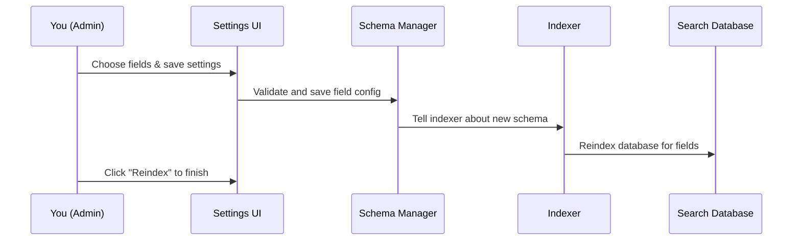

# Chapter 1: Field Configuration UI & Settings (WPLoupe_Settings_Page)

Welcome! In this chapter, we'll explore one of the most important features in WP Loupe: the **Field Configuration UI & Settings** powered by `WPLoupe_Settings_Page`. This is the "control panel" where you decide *what* content gets searched, *how* it's searched, and *how relevant* results should be.

Whether you want users to find posts by their tags, filter by categories, sort by dates, or prioritize titles in results—this is where you set it all up.  
Let’s learn using a simple goal:

**Use case:**  
>"I want my blog search to prioritize post titles, let users filter by category, and allow sorting by publish date."


## Why Is This Important?

Modern search is *not* just about finding any match. It's about finding the *best* match, fast. With WP Loupe's admin UI, you can:

- **Choose post types** (e.g. `post` or `page`) to include in search.
- **Pick which fields to index** (title, content, category, custom metadata).
- **Set weights** to make some fields (like title) more important.
- **Make fields filterable and sortable** (e.g., let users filter by category or sort by date).

*In short: You control what your visitors can find, and how!*


---

## Key Concepts

Let's break down the key pieces. Imagine building your own search engine dashboard, but extremely beginner-friendly:

### 1. **Post Types**
*Which types of content should be searchable?*

_For example:_
- Posts (blog entries)
- Pages (static pages)
- Custom types (like 'Product', 'Event', etc.)

### 2. **Fields**
*Which detail about each post should be searchable or used for filtering?*

_Common fields include:_
- Title
- Content
- Author
- Publish Date
- Custom metadata (e.g., "price", "location")

### 3. **Weights**
*How important is this field in search relevance?*

_E.g., making "title" twice as important as "content":_

```
# 'Title' field gets a weight of 2.0
# 'Content' field gets a weight of 1.0
```

### 4. **Filterable & Sortable**
*Should users be able to filter or sort using this field?*

- **Filterable:** e.g., "Show posts only from Category X"
- **Sortable:** e.g., "Sort results by Newest first"


---

## How Do You Use the Field Configuration UI?

This UI lives in WordPress Admin under `Settings > WP Loupe`.  
Let’s walk step-by-step through the use case.

#### 1. **Select Post Types**

- Go to the WP Loupe settings page.
- Find the **"Select Post Types"** dropdown.
- Choose `post` (blog post) and perhaps others.  
  _(Tip: Hold CTRL/CMD to select multiple!)_

#### 2. **Configure Fields for Each Post Type**

You’ll see a table for each post type like:

| Field       | Indexable | Weight | Filterable | Sortable | Sort Direction |
|-------------|-----------|--------|------------|----------|---------------|
| post_title  | ✓         | 2.0    |            | ✓        | desc          |
| post_date   | ✓         | 1.0    |            | ✓        | desc          |
| category    | ✓         | 1.0    | ✓          |          |               |
| post_content| ✓         | 1.0    |            |          |               |

Here's what you do for our use case:

- Make **post_title** indexable and set its weight to **2.0**.
- Make **category** indexable **and filterable**.
- Make **post_date** indexable and **sortable** (choose "Descending" to show newest first).
- Leave **post_content** indexable with weight **1.0**.

This lets your search prioritize titles, let users filter by category, and sort by date.

> **Tip:** Whenever you change these settings, click **Reindex** to update the search index.

#### 3. **Save & Reindex**

Click the **Reindex** button. This will rebuild the search database so changes take effect.

---

## Example: Setting Field Options

Let’s see what happens when you configure these values.

### Code Example: Saving Options

```php
update_option( 'wp_loupe_fields', [
    'post' => [
        'post_title' => [
            'indexable'   => true,
            'weight'      => 2.0,
            'filterable'  => false,
            'sortable'    => true,
            'sort_direction' => 'desc'
        ],
        // ... other fields ...
    ],
]);
```
_This configuration says: for "post" post type, prioritize the title in searches, and make it sortable by title (descending)._


### Code Example: Making a Field Filterable

```php
'category' => [
    'indexable'   => true,
    'weight'      => 1.0,
    'filterable'  => true,
    'sortable'    => false,
    'sort_direction' => 'asc'
]
```
_This makes the "category" field filterable, letting users narrow search results by category._


---

## Under the Hood: How Does It Work?

Let’s follow what happens after you save your field choices. Here is a simple flow:



**Breakdown:**
- **You** adjust fields in the UI.
- **UI** saves your config (which fields to index, weights, etc).
- **Schema Manager** validates and saves the layout.
- **Indexer** rebuilds the index with these choices.
- On **Reindex**, your database is rebuilt to match the new configuration.

### How the UI Finds Available Fields

Internally, it finds all the possible fields for a post type by checking:
- Core WordPress fields (like title, content).
- Saved schema settings.
- Custom metadata keys (if they’re found on published posts).

**Example (simplified)**:

```php
$fields = [
    'post_title' => true,
    'post_content' => true,
    'category' => true,
    // ... discovered meta fields ...
];
```
_These are options you'll see in the field configuration table for each post type._


### Saving Your Choices

When you click "Save", WP Loupe:
- **Sanitizes** inputs (ensures valid values and types).
- **Clears the schema cache** so changes apply.
- **Persists** config in WP options.

**Code Example (Sanitize):**

```php
if ( ! empty( $settings['indexable'] ) ) {
   // save config for field
}
```
_Only saves fields you mark as indexable._

---

## How the Field Configuration UI Talks to Other Parts

This configuration is the foundation for *everything else* in WP Loupe. Other chapters will show how these choices control what gets pulled into the index ([Indexing & Document Preparation](07_indexing___document_preparation__wp_loupe_indexer.md)), how users can search and filter ([Search Integration Hooks](02_search_integration_hooks__wp_loupe_search_hooks__.md)), and more.

---

## Conclusion & What's Next

With the Field Configuration UI, you can **empower your WordPress search**—choosing exactly what's important, and how results should be presented.  
You learned how to:
- Select post types,
- Fine-tune field importance,
- Enable filtering and sorting.

It's beginner-friendly, powerful, and lets you adjust search without writing code.

Ready for the next step? See how your settings power instant search results in [Search Integration Hooks (WP_Loupe_Search_Hooks)](02_search_integration_hooks__wp_loupe_search_hooks__.md)!  

---

*Feel free to reference this chapter any time you want to adjust what your search engine prioritizes. Happy searching!*

---

Generated by [AI Codebase Knowledge Builder](https://github.com/The-Pocket/Tutorial-Codebase-Knowledge)