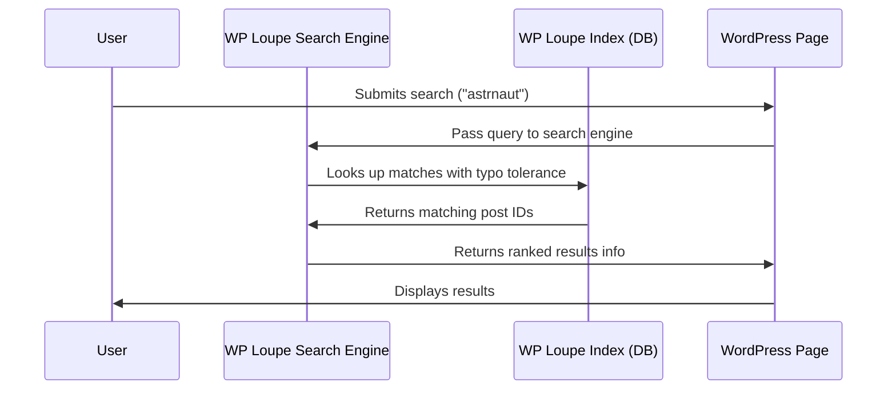

# Chapter 1: WP Loupe Search Engine

Welcome to the first chapter of the WP Loupe tutorial! In this chapter, you'll learn what the **WP Loupe Search Engine** is, why it's useful, and how to use it for fast, powerful searches on your WordPress site.

---

## Why Do We Need a Search Engine for WordPress?

Imagine you have a big library full of books (your WordPress site full of posts and pages). When someone asks the librarian (your website) "Find me every book about space travel!", it would take a long time to check every book one by one. We need the librarian to have an **index** — a smart way to quickly jump to what matters.

The **WP Loupe Search Engine** acts as this intelligent librarian. It's designed to:
- Quickly search your site's content (posts, pages, or custom post types)
- Work with advanced features (like typo tolerance, filtering, sorting, and pagination to show results page by page)
- Deliver accurate and relevant search results for your visitors

### Central Use Case: "I want my site’s search box to find the right posts FAST, even with typos or filters!"

---

## What Is the WP Loupe Search Engine?

**WP Loupe Search Engine** is a special "search brain" for WordPress. It looks through an optimized search index (not just regular database tables!), so searches are *lightning fast* and more relevant.

- **Handles user searches:** When someone searches, it reads the query, checks the index, and returns best-matching results.
- **Features:** It supports typo-tolerance (small mistakes in spelling), filtering (e.g., by category), sorting (e.g., newest first), and pagination (splits results into pages).
- **Safe for beginners:** You don’t need to know SQL or complex programming.

---

## Key Concepts, Explained Simply

Let's break down the main concepts:

| Concept          | What It Means (Friendly)                                             |
|------------------|---------------------------------------------------------------------|
| **Search Query** | What the user types in the search box.                              |
| **Index**        | Like a phone book for your content—optimized for speed!             |
| **Filtering**    | Limiting results (e.g., only posts in "Space" category).            |
| **Sorting**      | Organizing results (e.g., latest first, A-Z).                       |
| **Pagination**   | Splitting results into pages (e.g., 10 per page).                   |
| **Typo Tolerance**| Still finding results if "astrnaut" is misspelled as "astronaut".  |

---

## A Simple Search Example

Let’s solve a common use case—the user wants to search for "astronaut" but accidentally types "astrnaut".

### What the User Does
1. Types "astrnaut" in the search box.
2. Clicks "Search".

### How WP Loupe Handles It (Step by Step):
```php
// Instantiate the search engine (for posts and pages)
$search = new WP_Loupe_Search_Engine(['post', 'page']);

// Run the search
$results = $search->search('astrnaut');
```
This will search through the index, understand the typo, and still find pages and posts about "astronauts".

**Result**: `$results` is an array of all matching posts/pages with info like `title`, `url`, and a **score** for relevance.

---

## Example Output

Here’s what results might look like:
```php
[
  [
    'id' => 42,
    'title' => 'The Life of an Astronaut',
    'url' => 'https://example.com/life-of-an-astronaut',
    'post_type' => 'post',
    '_score' => 8.5,
  ],
  // ...more results
]
```
Results are *ranked* so the best matches show up first!

---

## Breaking Down the Internals

Let's peek under the hood to see how it works.

### Step-by-Step Sequence

**Imagine this path:**

1. User submits a search term on your site.
2. WP Loupe receives the term.
3. It looks in its fast index.
4. It sorts and filters results.
5. It returns the best list to WordPress.

Here’s an easy diagram to visualize:



---

### How Does the Code Actually Work?

When you call:
```php
$search = new WP_Loupe_Search_Engine(['post', 'page']);
```
- This prepares the search engine and loads the indexes for all chosen post types.

```php
$results = $search->search('astrnaut');
```
- Calls the main `search()` method (see `includes/class-wp-loupe-search-engine.php`).
- For each post type, it looks up matches **in the indexed database**, using typo-tolerance.
- Results are ranked, scored, and combined.
- Returns an array of hits (with fields like `id`, `title`, `url`).

**Tiny Example:**
```php
$search = new WP_Loupe_Search_Engine(['post']);
$results = $search->search('moon landing');
foreach ($results as $hit) {
    echo $hit['title'];
    // Will print post titles that match "moon landing"
}
```
**Explanation:** This finds all "post" items related to "moon landing", showing the best matches first.

---

## How Does WP Loupe Integrate with WordPress Search?

By hooking into WordPress, WP Loupe can completely replace the default (slow) search:

- When someone uses the search box, it intercepts the query before WordPress touches the database.
- Returns fast, relevant, typo-tolerant results.

**Code example (internally handled):**
```php
add_filter( 'posts_pre_query', [ $loupe_hooks, 'posts_pre_query' ], 10, 2 );
```
*You don’t need to do this manually — the plugin sets it up for you!*

---

## Under the Hood: File Locations

- **Core search engine logic:**  
  `includes/class-wp-loupe-search-engine.php`
- **WordPress hooks for search:**  
  `includes/class-wp-loupe-search-hooks.php`
- **REST API for external queries:**  
  `includes/class-wp-loupe-rest.php`

---

## Wrapping Up

You now understand the heart of WP Loupe: the **Search Engine** that powers fast, smart, and flexible searches on your WordPress site. Whether users are typo-prone or need filtered/sorted results, the search engine smoothly provides what they need.

Next, we’ll discover how to **control search settings and manage what gets indexed** in [Settings & Admin UI](02_settings___admin_ui_.md). See you there!

---

Generated by [AI Codebase Knowledge Builder](https://github.com/The-Pocket/Tutorial-Codebase-Knowledge)