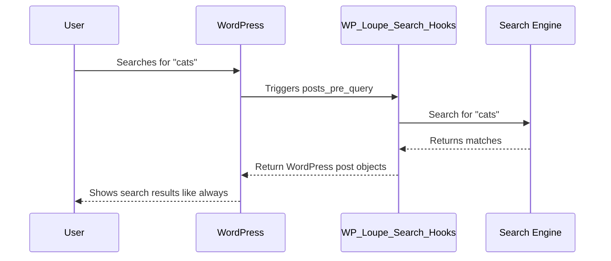

# Chapter 2: Search Integration Hooks (WP_Loupe_Search_Hooks)

Coming from [Chapter 1: Field Configuration UI & Settings (WPLoupe_Settings_Page)](01_field_configuration_ui___settings__wploupe_settings_page__.md), you now know how to choose *what* your search engine should look for.  
But how does "super fast" search actually appear for your site visitors?  
That magic comes from the **Search Integration Hooks** — specifically, the `WP_Loupe_Search_Hooks` class!  
Let’s see how it turns all your field choices into instant and seamless search results.

---

## Why Do We Need Search Integration Hooks?

Let’s start with an example:

**Use case:**
> *"I want searches on my site to use WP Loupe’s fast engine instead of WordPress’s slow default search, without changing my theme or plugins."*

That’s exactly the job of search hooks!  
**Hooks** are the “valves” that intercept WordPress’s normal search, swap it with Loupe’s smart search, and then hand results back in WordPress’s usual way.  
Your themes and plugins won’t even know the difference (they still use `WP_Query` and the results look just like normal posts).

---

## Key Concepts (As Simple as Possible!)

Let’s break it down:

### 1. **Intercepting Search**

Imagine WordPress is about to fetch posts for a search.
`WP_Loupe_Search_Hooks` says:  
> "Wait! Let *me* get those results way faster!"

It listens for when WordPress is about to run a search, and offers to jump in.

### 2. **Using Loupe’s Fast Search**

Instead of the normal (slow) database search, Loupe runs its own search engine.  
Results come back in milliseconds!

### 3. **Swapping in Smart Results**

The results must look *just* like WordPress posts (so themes work as always).  
Loupe wraps its results in real post objects.

### 4. **Handling Pagination & Timing**

It makes sure paging (like “next page” or “show more”) works perfectly and even adds a little performance log in the HTML footer (for debugging).

---

## How Does It Work for You?

**You don’t need to do anything special.**  
Once WP Loupe is installed and configured (see [Chapter 1](01_field_configuration_ui___settings__wploupe_settings_page__.md)), the hooks just take over!

Here’s a super simple flow:

1. A user makes a search (e.g., "cats").
2. WP Loupe “hooks” in, replaces the normal search engine with Loupe’s, and shows results.
3. Pagination, themes, plugins, etc., all work like normal — but faster!

**What will you notice?**  
- Your search is *much* faster!
- Results obey all your [Field Configuration](01_field_configuration_ui___settings__wploupe_settings_page__.md) settings.
- Nothing in your theme or plugins breaks.

---

## Minimal Example: How the Hook Intercepts Search

Let’s see a super simplified version of how it works (real code is more detailed):

```php
add_filter('posts_pre_query', function($posts, $query) {
    // Only intercept main search
    if ($query->is_main_query() && $query->is_search()) {
        // Use Loupe to find matching posts
        $hits = loupe_engine()->search($query->get('s'));
        // Convert $hits to post objects
        return loupe_create_post_objects($hits);
    }
    return null;
}, 10, 2);
```
_This attaches to the search, checks if it’s a main query and a search, runs Loupe, and returns Loupe’s results as real posts._

**Result:**  
Users see results from WP Loupe, but themes get normal WordPress posts.

---

## Real Example: The `WP_Loupe_Search_Hooks` Class

Let’s peek into the real class and focus on its key methods — so you can connect the dots.

### Registering the Hook

The class tells WordPress which hooks to listen to:

```php
public function register(): void {
    add_filter( 'posts_pre_query', [ $this, 'posts_pre_query' ], 10, 2 );
    add_action( 'wp_footer', [ $this, 'action_wp_footer' ], 999 );
}
```
_Explanation: When you visit the front end, it adds a filter to intercept search queries, and an action for performance logging (footer)._

---

### Handling the Intercept

Here’s how the main interception works (simplified):

```php
public function posts_pre_query( $posts, $query ) {
    if ( ! $this->should_intercept_query( $query ) ) {
        return null; // Don't handle non-search queries
    }
    $hits = $this->engine->search( $query->get('s') );
    return $this->create_post_objects( $hits );
}
```
- First, checks if this is a real search.
- Calls Loupe’s search engine.
- Converts results to post objects for themes.

---

### Pagination: Making “Page 2” Work

Pagination is handled by slicing the results:

```php
$paged_posts = array_slice( $all_posts, $offset, $posts_per_page );
```
- `array_slice` splits the big result set into page-sized chunks (so everything paginates as expected).

---

### The Magic Behind the Scenes

What *actually* happens, step by step?  
Imagine a user searching for "cats":



**Notice:**  
- The theme and plugins *don’t* have to change.  
- The user just sees results much faster.

---

## How to Control Loupe Search Integration

**You don’t need to write code!**  
WP Loupe activates this automatically on the front end.

If you want to customize things (like results per page), you can add a simple filter:

```php
add_filter( 'wp_loupe_posts_per_page', function($n) { return 5; });
```
_This would show 5 results per page in search._

---

## How Does It Play with the Rest of WP Loupe?

- All your *field choices* in [Chapter 1](01_field_configuration_ui___settings__wploupe_settings_page__.md) control **what is indexed** and thus **what is returned here**.
- The *search engine* under the hood is covered in [Chapter 6: WP Loupe Search Engine](06_wp_loupe_search_engine__wp_loupe_search_engine__.md).
- Everything works together so that any changes you make in settings, indexing, or schema are reflected instantly in live search.

---

## A Quick Look Under the Hood (File References)

The core class is defined in:  
`includes/class-wp-loupe-search-hooks.php`  
It is loaded and created in the main plugin file:  
`includes/class-wp-loupe-loader.php`

```php
// In the loader:
$this->search_engine = new WP_Loupe_Search_Engine( $this->post_types );
$this->search_hooks  = new WP_Loupe_Search_Hooks( $this->search_engine );
$this->search_hooks->register();
```
_The loader makes sure the hooks are only active on the front end (never in admin or REST API)._

---

## In Summary

- **Search Integration Hooks** are the invisible “valves” that connect user searches to Loupe’s fast search — replacing WordPress’s default search instantly and transparently.
- Your visitors never notice a change, but your searches get *much* faster.
- Everything “just works” with your theme and plugins.
- No coding or template changes required!

Ready to use Loupe-powered search forms, and add search blocks to pages?  
Head over to [Chapter 3: Block & Form Integration (WP_Loupe_Blocks)](03_block___form_integration__wp_loupe_blocks__.md) to discover how search forms connect to Loupe!

---

---

Generated by [AI Codebase Knowledge Builder](https://github.com/The-Pocket/Tutorial-Codebase-Knowledge)