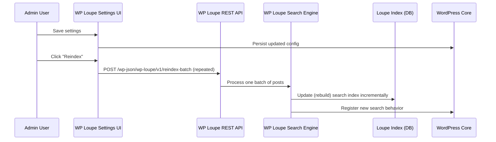

# Chapter 2: Settings & Admin UI

Welcome back! In [Chapter 1: WP Loupe Search Engine](01_wp_loupe_search_engine_.md), you learned what the WP Loupe Search Engine is, and how it supercharges search on your WordPress site.

Now, let’s talk about *controlling* that search engine—choosing exactly what gets indexed, how results are ranked, and more. This is where the **Settings & Admin UI** come in.

---

## Why Do I Need Settings & an Admin UI?

Think of WP Loupe’s settings like a control panel for your library’s search system.  
Suppose you want to:

- **Choose which content is searchable:** Should recipes, products, or blog posts appear?
- **Control how results are ranked:** Should titles matter more than content?
- **Add search filters:** Let users filter by author, category, or custom fields.
- **Fine-tune advanced features:** How much typo-tolerance do you want? Should prefix searches (“astr”) match “astronaut”?

All of this is handled through a **friendly graphical settings page,** so you can customize your site’s search—no code required.

### Central Use Case Example

> "I want to make Blog Posts and Products searchable, give product titles extra weight, and allow filtering by Product Category—all without writing code."

This chapter will show you *exactly* how to do that!

---

## Key Concepts

WP Loupe’s settings are organized into a few main ideas:

1. **Choosing What Gets Indexed**  
   Select which post types (like posts, pages, products) and **fields** (such as title, content, or custom fields) should be searchable.

2. **Customizing Field Behavior**  
   - **Weight:** How important is a field in ranking (higher = more important).
   - **Filterable:** Can users filter results by this field?
   - **Sortable:** Can users sort results by this field?

3. **Tuning Advanced Search Features**  
   Control things like typo-tolerance and prefix search for a smoother user experience.

Let’s look at these, step by step!

---

## The Settings Page: Your Search Dashboard

Once WP Loupe is installed and activated:

1. Go to **Settings → WP Loupe** in your WordPress admin panel.
2. You’ll see tabs and options—let’s break them down!

### 1. Selecting Post Types

You likely have many types of content (posts, pages, maybe even 'products' or 'recipes').

**How to do it:**  
- On the WP Loupe settings page, find the ‘Select Post Types’ dropdown.
- Check which ones you want *included in site search*.

**Example:**
- You enable `post` (Blog Posts) and `product` (WooCommerce Products).
- Result: Only blog posts and products will show in search results.

### 2. Configuring Fields: Indexable, Weight, Filterable, Sortable

After picking your post types, you get to fine-tune **fields** for each type (like Title, Content, Category).

For each field you can set:

| Setting      | What it does                                  | Example                             |
|--------------|-----------------------------------------------|-------------------------------------|
| Indexable    | Should this field be searched?                | Yes for product titles, no for SKU  |
| Weight       | How important is this field in ranking?       | 2.0 = very important; 1.0 = normal  |
| Filterable   | Can users filter by this field in search?     | Yes for category, no for content    |
| Sortable     | Can results be sorted by this field?          | Yes for price, no for long text     |

**Configuring 1 field:**  
Suppose you want "product_title" to have *higher importance* in search results.

- Check the **Indexable** box for "product_title".
- Set **Weight** to `2.0`.
- (Optionally) Mark it as **Filterable** or **Sortable**.

**How it looks:**

```plaintext
+--------------+-----------+--------+------------+----------+---------------+
| Field        | Indexable | Weight | Filterable | Sortable | Sort Direction|
+--------------+-----------+--------+------------+----------+---------------+
| product_title|    ✓      |  2.0   |     -      |     ✓    |    Asc/Desc   |
| price        |    ✓      |  1.0   |     ✓      |     ✓    |    Asc/Desc   |
| description  |    ✓      |  1.0   |     -      |     -    |      -        |
+--------------+-----------+--------+------------+----------+---------------+
```

*You just click checkboxes and type weights—no code needed!*

---

### 3. Advanced Search: Typo Tolerance & Prefix Search

Want search to forgive typos? Want users to find content by typing just the start of a word?

- In the **Advanced** tab (Settings → WP Loupe → Advanced), you’ll find:
  - **Enable Typo Tolerance:** Allows search to match small spelling errors.
  - **Minimum Prefix Length:** How many characters before prefix search activates (e.g., typing “Huck” finds “Huckleberry” if set to 3).

Set options by checking boxes or changing values.

---

## How Do These Settings Actually Work?

When you save your settings, here’s what happens:

1. **Select Post Types:** WP Loupe sets up a fast search index for only those types.
2. **Fields Setup:** Builds the index using the fields and weights you chose.
3. **Advanced Options:** Applies your typo/prefix preferences to all searches.

*Every time you save settings and then reindex, these rules control your search engine’s behavior!*

Let’s see the step-by-step flow.

---

### What Happens When You Change Settings?

Here’s a simplified sequence of what *internally* happens when you update your settings:



- **Result:** Your WordPress searches will now follow the *rules and structure* you just chose!

---

## Example: Indexing a Custom Post Type with Custom Fields

Let’s say you run a Recipe blog with a custom post type: `recipe`.

You want *search* to:

- Index Title, Ingredients (custom field), and Cook Time (custom field)
- Make Cook Time filterable and sortable (so users can find recipes by prep time)
- Make Title more important than Ingredients

**How to do it (in the Admin UI):**

1. **Select Post Type:**  
   - Check "recipe" in the “Select Post Types” dropdown.

2. **Configure Fields (in field table):**

| Field         | Indexable | Weight | Filterable | Sortable | Direction   |
|---------------|-----------|--------|------------|----------|------------|
| title         |     ✓     | 2.0    |      -     |    ✓     | Asc/Desc   |
| ingredients   |     ✓     | 1.0    |      -     |    -     |     -      |
| cook_time     |     ✓     | 1.0    |     ✓      |    ✓     | Asc/Desc   |

3. **Save Settings**, then click **Reindex**.

**What happens:**  
- Now, searching “quick pasta” finds recipes FAST—weighted by title and ingredients.
- Users can filter and sort by cook time.

---

## Under the Hood: How WP Loupe Implements Settings

Let’s peek inside to see how this works (no code required to use it!).

### Step-by-Step

1. **Admin chooses settings in UI.**
2. WP Loupe **saves these settings** to the database.
3. When you click **Reindex**, WP Loupe:
   - Creates or updates the search index for the selected post types.
   - Only uses the fields and rules you configured.
   - Respects advanced options (typo-tolerance, prefix search).

4. **All future searches** use your choices automatically!

---

### How Is the Admin UI Built? (A Simple Walkthrough)

- The settings page is made with WordPress admin tools, using dropdowns, checkboxes, and tables.
- When you add or remove post types/fields, the page updates dynamically using JavaScript to show only what’s relevant.
- Fields are discovered automatically—even custom fields show up for easy selection!

**Key files involved:**
- UI code: `lib/js/admin.js`
- Settings logic: `includes/class-wp-loupe-settings.php`

#### A Tiny Example: Saving Field Settings

When you toggle a checkbox, the browser prepares form data that looks like:

```php
// Example field settings array (simplified)
[
  'recipe' => [
      'title'       => [ 'indexable' => true, 'weight' => 2.0, 'filterable' => false ],
      'ingredients' => [ 'indexable' => true, 'weight' => 1.0, 'filterable' => false ],
      'cook_time'   => [ 'indexable' => true, 'weight' => 1.0, 'filterable' => true ],
  ]
]
```

These settings are saved and applied during reindexing—no code needed!

---

---

Generated by [AI Codebase Knowledge Builder](https://github.com/The-Pocket/Tutorial-Codebase-Knowledge)