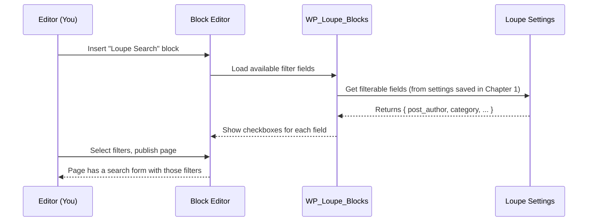

# Chapter 3: Block & Form Integration (WP_Loupe_Blocks)

_Come from [Chapter 2: Search Integration Hooks (WP_Loupe_Search_Hooks)](02_search_integration_hooks__wp_loupe_search_hooks__.md)? Great! Now, let’s see how you can give your users a beautiful, filterable search no matter your favorite way of building WordPress sites—whether using blocks, classic search forms, or even shortcodes._

---

## Why Does “Block & Form Integration” Matter?

Let’s say you’ve already made your search fields filterable in [Chapter 1](01_field_configuration_ui___settings__wploupe_settings_page__.md), and seen WP Loupe speed up your results in [Chapter 2](02_search_integration_hooks__wp_loupe_search_hooks__.md).  
But **how do those filters actually show up for your visitors?**  
**How do you add a search with “filter by author” *anywhere* on your site—using blocks, forms, or shortcodes, without code or theme changes?**

### Main Use Case

> *“I want to add a search box (as a block or a form) that lets users filter by author or category, anywhere I want—pages, widgets, or even classic themes!”*

That’s where `WP_Loupe_Blocks` comes in: it acts as a universal *adapter* that connects WP Loupe’s advanced filter logic to **all** the ways you might want to add a search to your site.

---

## What Does WP_Loupe_Blocks Do? (The Big Picture)

- **Registers a Block Variation:** Adds a “Loupe Search” block in the editor—shows extra filter options visually.
- **Injects Filters into Classic Search Forms:** Makes old-school search forms in themes smarter, automatically.
- **Provides a Shortcode:** So you can drop a filterable search almost anywhere via `[loupe_search]`.
- **Knows Your Config:** Only shows filter options for fields you’ve marked as filterable in settings.

Let’s break down each piece in beginner language.

---

## Key Concepts (How WP_Loupe_Blocks Helps You)

### 1. **Block Editor Integration: “Loupe Search” Block**

If you use modern block themes or the Block Editor, a special “Loupe Search” block will appear.  
You can choose which filters (like category, author, etc.) to show before adding the block.

### 2. **Modify Classic Search Forms—No Coding!**

Even if your site uses an old-school PHP-based theme with a default search form, new filter fields will appear automatically if any are configured.

### 3. **Shortcode for Placement Freedom**

Inside posts, page builders, or widgets? Use `[loupe_search]` and get the same smart, filterable search—no technical tweaks needed.

---

## Beginner-Friendly Workflow (How To Use It)

Let’s see how the main use case works in **3 scenarios**.

### **A. Using the Block Editor (Gutenberg):**

1. **Open the WordPress Block Editor** for a post or page.
2. **Add Block**: Search for “Loupe Search” and insert it.
3. **Choose Filters**: In the block sidebar, pick your post type and check which fields (category, author, etc.) to add as filters.
4. **Publish**: Visitors see a search with those custom filters!

**Example: Add a filter for “Author” and “Category”.**

_(No code to write! Just click in the block editor.)_

---

### **B. Classic Theme Forms:**

1. **Do nothing—automatic!**  
If your theme uses `get_search_form()` (as most do), whenever users see a search box, they’ll also see filter options for fields you enabled (unless a block search is already in use).

**For example:**  
If you’ve marked “category” filterable, the classic form shows a little “category” field so users can narrow their search.

---

### **C. Using a Shortcode (Anywhere):**

Want to add a filterable search to a page or widget? Paste this shortcode:

```plaintext
[loupe_search post_type="post" fields="post_author,category"]
```

**What it does:**  
- Makes a search form for “posts”
- Adds filter boxes for “Author” and “Category”.

> You can leave out `fields` to show all available filterable fields.

---

## Quick Example: What Gets Shown

If you configured [Chapter 1](01_field_configuration_ui___settings__wploupe_settings_page__.md) to make “author” and “category” filterable, your Loupe Search form will look like:

```
Search: [__________]  
Filters:
[Author:  __________]
[Category: __________]
[Search Button]
```

Users type anything in those filter boxes to narrow their search instantly!

---

## What’s Under the Hood? (Beginner’s Guide)

Let’s see what *really* happens when you add the Loupe Search block or use the shortcode.

### Step-by-Step: Adding a Loupe Search Block



**Explanation:**
- The block asks Loupe for all filterable fields.
- You choose which ones to show.
- When a visitor uses the form, those choices go right into the search!

---

## Internal Implementation: A Simple Look

### **How does the block know which fields are filterable?**

```php
$fields = get_option( 'wp_loupe_fields', [] );
// Only fields with 'filterable' => true are offered as filters
```
**Explanation:**  
- Pulls your filterable field choices straight from the settings.

---

### **How does it inject filters into the core search block’s HTML?**

Inside the block rendering:

```php
if ( /* Loupe filters active */ ) {
    // Add extra <label> with <input> for each chosen filter field
    $form .= '<label>Author <input type="text" name="loupe_filter[post_author]"></label>';
}
```
**Explanation:**  
- Every filterable field gets an input box added before the form closes.

---

### **How about the shortcode?**

```php
add_shortcode( 'loupe_search', function($atts) {
    // Build a <form> with fields for each requested or all filterable fields
    // Output the search box with those fields
});
```
**Explanation:**  
- The shortcode handler outputs a search form with extra fields for what you want.

---

## File Pointers For (Curious) Beginners

- **Block and form magic happens in:**  
  `includes/class-wp-loupe-blocks.php`
- **Block editor UI powered by:**  
  `lib/js/block-search-variation.js`
- **Classic form modifications hooked on:**  
  WordPress's `get_search_form` filter

---

### Minimal Code Reference: Overriding a Search Form

**Inject filter fields before the search form’s closing tag**

```php
if ( strpos( $form, '</form>' ) !== false ) {
    $form = str_replace( '</form>', $filters_markup . '</form>', $form );
}
```
**Plain English:**  
- *If we see `</form>`, tuck our filter boxes right before the form closes so everything is submitted together.*

---

## Analogy Time!

Think of `WP_Loupe_Blocks` as an "adapter plug".  
No matter *where* you want to connect—block editor, classic forms, old themes, widgets—this adapter makes sure your Loupe-powered filters can be plugged in anywhere, ready for your visitors.

---

## So, What Did You Learn?

- **How to add Loupe-powered, filterable search to any part of your site**—using editor blocks, classic themes, or shortcodes.
- How WP_Loupe_Blocks figures out which filters to show—*always based on your settings from [Chapter 1](01_field_configuration_ui___settings__wploupe_settings_page__.md)*.
- What happens under the hood when you use a Loupe-powered search form—no code required.

---

## Next Steps

> You're now ready to add powerful, filterable search everywhere!

Want to know how that search actually gets processed behind the scenes (including with AJAX or REST API calls)?  
Continue to [Chapter 4: REST API Handler (WP_Loupe_REST)](04_rest_api_handler__wp_loupe_rest__.md)!

---

---

Generated by [AI Codebase Knowledge Builder](https://github.com/The-Pocket/Tutorial-Codebase-Knowledge)