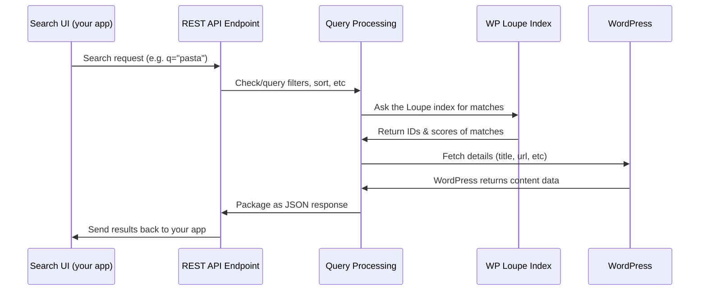

# Chapter 3: REST API & Endpoints

Welcome back! In [Chapter 2: Settings & Admin UI](02_settings___admin_ui_.md), you learned how to control **what gets searched** and fine-tune your website's search behavior.

Now, let's imagine...

> *"I want to build my own custom search box or connect an external app (like a mobile app), and I want it to get super-fast, typo-tolerant results from my WordPress site—even if they're not using the regular WordPress pages!"*

**How do you do that?**  
With the **REST API & Endpoints** provided by WP Loupe! 🎉

---

## Why Use a REST API?

Think of the **REST API** as a “front desk” or a receptionist for your website's search engine.

- **Visitors at the front desk** might be your own custom search UI, a mobile app, or even another server.
- They come up and *ask* questions like:  
  > "Show me all blog posts about pasta."  
  > "List all available product categories."  
  > "Find recipes where cook time is under 20 minutes."

**The REST API's job:** Accept these questions over the web and send back answers (search results, field lists, etc.) in a way that's easy for other programs to understand.

---

## Key Concepts

Let's break down the basics:

| Term                | What It Means (Friendly)                                                                                     |
|---------------------|-------------------------------------------------------------------------------------------------------------|
| **REST API**        | A way for other programs or UIs to talk to your site over the internet, using standard web messages.         |
| **Endpoint**        | A specific "address" at your site, like `/wp-json/wp-loupe/v1/search`, where you send data and get results.  |
| **GET vs POST**     | Two main ways to ask questions:  
  - `GET` = simple search (URL plus ?q=spaceships)  
  - `POST` = advanced search (send filters, sorts, etc in a small package called JSON) |
| **JSON**            | A simple way to bundle up questions/answers (looks like a giant array or object, easy for code to read).     |
| **Filtering/Sorting/Pagination** | Asking for only certain results (e.g., by category), in a certain order, or split into pages.   |

---

## Typical Beginner Use Case

Let's focus on **building a custom search box** on your homepage that searches for posts and products (with typo protection!), using JavaScript or your own app.

---

## The Main Search Endpoints

WP Loupe gives you two main search endpoints:

1. **Basic Search**  
   - **URL:** `/wp-json/wp-loupe/v1/search`  
   - **Method:** GET  
   - **Parameters:** `q` (your search), plus filters like `post_type`

   **Example URL:**  
   ```
   https://example.com/wp-json/wp-loupe/v1/search?q=pasta&post_type=recipe
   ```

2. **Advanced Search**  
   - **URL:** `/wp-json/wp-loupe/v1/search`  
   - **Method:** POST  
   - **Body:** JSON (supports advanced things like filtering, sorting, facets)
   
   **Example POST Body:**
   ```json
   {
     "q": "chocolate",
     "postTypes": ["product"],
     "page": { "number": 1, "size": 5 }
   }
   ```

---

## How to Use the REST API

### 1. Simple Search (GET)

Suppose you want to search *posts* and *pages* for "astronaut":

**Make a GET request to:**
```
https://yoursite.com/wp-json/wp-loupe/v1/search?q=astronaut
```

**What you get back:**  
A list of results (posts/pages) in JSON, looking like:

```json
{
  "hits": [
    {
      "id": 123,
      "title": "The Life of an Astronaut",
      "url": "https://yoursite.com/life-of-an-astronaut",
      "post_type": "post",
      "post_type_label": "Post",
      "excerpt": "Being an astronaut takes grit...",
      "_score": 9.6
    }
    // ...More results!
  ],
  "pagination": { "total": 11, "per_page": 10, "current_page": 1, "total_pages": 2 }
}
```

**Explanation:**  
- Each item is a match!
- `_score` = how well it matches your search (“relevance”)
- `pagination` tells you if there are more pages

### 2. Advanced Search (POST, for filters/facets)

Suppose you want only products under $20 and in the "snacks" category.

**Send a POST request:**

**URL:**  
```
https://yoursite.com/wp-json/wp-loupe/v1/search
```

**Body:**  
```json
{
  "q": "",
  "postTypes": ["product"],
  "filter": {
    "type": "and",
    "items": [
      { "type": "pred", "field": "price", "op": "lte", "value": 20 },
      { "type": "pred", "field": "category", "op": "eq", "value": "snacks" }
    ]
  },
  "page": { "number": 1, "size": 10 }
}
```

**What you get back:**  
A list of matching products, each with title, url, score, etc.

---

## How the REST API Works (Behind the Scenes)

Here’s a peek at what *happens* when you use these endpoints.



**Translation:**
- Your UI or script asks the REST API for results.
- The API (in PHP) builds a search query—using any filters or options you provided.
- It talks to [WP Loupe Search Engine](01_wp_loupe_search_engine_.md) and the Loupe index to get matching post IDs.
- It grabs details from WordPress (titles, links).
- Packages everything up into a JSON response for your app!

---

## Changing What Gets Searched or Filtered

Remember:  
**You control what REST API can find!**  
When you tweak which post types or fields get indexed by the [Settings & Admin UI](02_settings___admin_ui_.md),  
the REST API uses that setup. If you mark a custom field as *filterable*, REST API search can filter on it!

---

## Understanding Other REST Endpoints

In addition to search, WP Loupe's REST API provides:

| Endpoint                                               | What it does                     | Example Purpose                |
|--------------------------------------------------------|----------------------------------|-------------------------------|
| `/post-type-fields/{post_type}` (GET)                  | Lists all searchable fields      | Build a dynamic search UI     |
| `/create-database` (POST)                              | Sets up a new index for a type   | Admin adds new content type   |
| `/delete-database` (POST)                              | Deletes an index for a type      | Admin removes content type    |
| `/reindex-batch` (POST)                                | Reindexes in small batches       | Admin rebuilds indexes safely |

**All these endpoints reply in JSON, making them easy to use with JavaScript, apps, or automation!**

### Note on `/reindex-batch`

`/wp-json/wp-loupe/v1/reindex-batch` is an **admin-only maintenance endpoint** used by the Settings UI “Reindex” button.
It processes **one batch per request**, allowing large sites to rebuild indexes without hitting request timeouts.

---

## Internals: How Is the REST API Coded?

- Core code:  
  [`includes/class-wp-loupe-rest.php`](includes/class-wp-loupe-rest.php)

- REST routes are registered with clear "callbacks" for each endpoint.
- Search requests are handled by methods like:

```php
public function handle_search_request($request) {
    $query = $request->get_param('q');
    // ...set up search engine, perform search...
    return rest_ensure_response($results);
}
```

- It uses helper classes:  
  - [WP Loupe Search Engine](01_wp_loupe_search_engine_.md) does the matching  
  - [Schema Manager](05_schema_manager_.md) decides which fields are allowed/filtered
- All filtering/sorting is checked before running the search.

---

## Example: Minimal JavaScript Fetch

Want to search from your JavaScript code?  
Here's a tiny working example (for a simple GET):

```js
fetch('/wp-json/wp-loupe/v1/search?q=moon')
  .then(r => r.json())
  .then(data => {
    data.hits.forEach(hit => {
      console.log(hit.title + " – " + hit.url);
    });
  });
```
*This will print all titles and links found for "moon" right in your browser!*

---

## Recap

- **REST API** lets *any* app or UI search your WordPress content—fast, smart, typo-tolerant.
- You call simple endpoints, get clear results.
- Use GET for basics, POST for advanced filters.
- [Settings & Admin UI](02_settings___admin_ui

---

Generated by [AI Codebase Knowledge Builder](https://github.com/The-Pocket/Tutorial-Codebase-Knowledge)