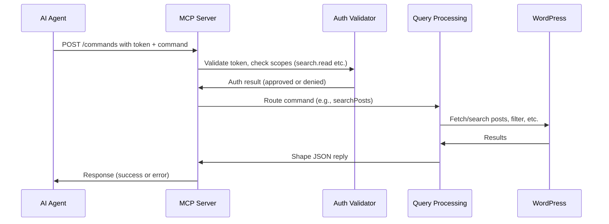

# Chapter 4: MCP Server (Model Context Protocol)

Welcome back! In [Chapter 3: REST API & Endpoints](03_rest_api___endpoints_.md), you learned how to use WP Loupe’s REST API for searching and fetching content externally.

Now let’s take search automation to the next level:

## Motivation: Why "MCP Server"?

Imagine you want to let a **smart agent** or an AI assistant perform advanced tasks on your website—like searching posts **securely**, pulling content for analysis, or discovering what kinds of content exist—all without giving it full admin access.

> **Use Case:**  
> "I want my site's search and content to be accessible in a secure, well-documented way so AI assistants or automation tools can interact with it—discover what's available, authenticate, and use search commands, safely!"

This is what the **MCP Server (Model Context Protocol)** is for.  
It acts like a **trusted gateway** between your site and smart agents—so they know what’s available, how to authenticate, and how to ask for what they need using clear, agreed-upon rules.

---

## What is the MCP Server in WP Loupe?

- **MCP Server** is an advanced module inside WP Loupe.
- It exposes special endpoints so external tools (like AI, automation systems, or other sites) can:
  - *Discover* your site’s search capabilities
  - *Authenticate securely* before using those capabilities
  - *Interact via standard commands* (like searching posts, fetching post details)
- It uses the **Model Context Protocol**: think of this as a *way to talk to websites that makes everything predictable and safe*, especially for automated agents.

**Analogy:**  
If your REST API from the last chapter is a public "reception desk" for simple questions, the MCP Server is a *VIP help desk* with security guards and a procedure manual—only trusted agents can get in and perform special actions!

---

## Key Concepts (Explained Simply)

Let’s break down the most important ideas behind MCP Server:

| Concept         | Friendly Explanation                                                              |
|-----------------|----------------------------------------------------------------------------------|
| **Discovery**   | Agents can ask: "What commands and data does this site support?"                  |
| **Authentication** | Agents prove who they are before your site lets them do anything sensitive.    |
| **Standardized Commands** | There's a list of allowed actions (like `searchPosts` or `getPost`), each with clear rules. |
| **Scopes & Abilities** | Each permission (like ‘search only’ or ‘read post’) has a named badge—agents must prove they hold the right badges. |
| **Security & Rate Limiting** | The server checks IDs, tracks how many times agents ask for data, and locks down anything risky. |

---

### Central Use Case: A Step-by-Step Story

Let’s walk through how an AI assistant would use MCP Server:

1. **Discovery:**  
   The agent finds your site’s MCP manifest at:
   ```
   https://yourwebsite.com/.well-known/mcp.json
   ```
   This JSON file *tells it what commands and permissions are available.*

2. **Authentication:**  
   The agent requests a secure token with allowed "badges" (scopes):
   - For testing, you can use a dev token or request one via WP-CLI:
   ```sh
   wp wp-loupe mcp issue-token --scopes="search.read"
   ```
   Or via a special HTTP endpoint.

3. **Interaction:**  
   Using its token, it sends a command:
   ```json
   {
     "command": "searchPosts",
     "params": { "query": "moon", "limit": 2 }
   }
   ```
   To:
   ```
   https://yourwebsite.com/wp-json/wp-loupe-mcp/v1/commands
   ```
   The server checks the token, then replies with results:
   ```json
   {
     "success": true,
     "data": { "hits": [ /* posts about moon */ ] }
   }
   ```
   If the token is invalid, the reply looks like:
   ```json
   {
     "success": false,
     "error": { "code": "invalid_token", "message": "Access token not found" }
   }
   ```

---

## How to Use MCP Server: Step-by-Step

**1. Enable MCP in WP Loupe Settings**

Activate MCP Server in your WP Loupe plugin settings (an administrator does this).

**2. (Dev/Test) Get a Token for Authentication**

You can use WP-CLI (command line) to generate a token:

```sh
wp wp-loupe mcp issue-token --scopes="search.read"
```
*This gives you a "Bearer token" to prove you’re allowed to use MCP commands.*

**3. Discover Commands & Schema**

Anyone (public or agent) can fetch:
- MCP manifest:  
  ```
  GET https://yourwebsite.com/.well-known/mcp.json
  ```
  *Shows available commands, resources, abilities.*

- Protected resource metadata:  
  ```
  GET https://yourwebsite.com/.well-known/oauth-protected-resource
  ```
  *Lists how authentication works: which types, which endpoints.*

**4. Send an MCP Command with Token**

Example command call (using token):

```sh
curl -X POST \
     -H "Authorization: Bearer YOUR_TOKEN" \
     -H "Content-Type: application/json" \
     -d '{"command":"searchPosts","params":{"query":"moon","limit":3}}' \
     https://yourwebsite.com/wp-json/wp-loupe-mcp/v1/commands
```

**What you get back:**  
A JSON reply with matching posts, or an error if something went wrong.

---

### Example: Fetch One Post by ID

Send this command:

```json
{
  "command": "getPost",
  "params": { "id": 42 }
}
```
*You’ll receive the post details (title, URL, content as allowed).*

---

## Internal Concepts: What's Under the Hood?

Let’s walk through what happens inside WP Loupe when an MCP command arrives:


*Translation*: The server acts as a bouncer at a club. If the agent has the right token (VIP pass), it lets them inside to use commands. Each command is checked, filtered, and always follows the security rules.

---

## Beginner-Friendly Code Snippets

**1. Generate a Token Programmatically (WP-CLI):**

```php
// This command is run in the terminal, not in PHP!
wp wp-loupe mcp issue-token --scopes="search.read"
```
*Generates a token string for testing — copy and use as your "security badge".*

---

**2. Check Validity of Token Internally:**

```php
// Validate token, returning error if expired or invalid
$token_record = $server->oauth_validate_bearer('YOUR_TOKEN');
if ( is_wp_error($token_record) ) {
    // Handle error, show "invalid_token"
}
```
*WP Loupe checks if the token is good before allowing any action.*

---

**3. Handle an MCP Command:**

```php
// Inside MCP server, route a request
switch($command) {
    case 'searchPosts':
        // Runs the search, returns formatted results
        return $this->command_search_posts($params, $auth_context);
    // ... other commands like getPost ...
}
```
*Each allowed command is mapped to a safe function—that’s how the server stays secure.*

---

**4. Discovery Endpoint Definition (Internal)**
```php
// Grant auto-discovery for protocols like MCP
add_rewrite_rule('^\\.well-known/mcp.json/?$', 'index.php?wp_loupe_mcp_wellknown=manifest', 'top');
```
*This lets agents find the site's command and authentication info at a predictable place.*

---

### Relevant File Locations

- **Main MCP Server code:**  
  `includes/class-wp-loupe-mcp-server.php`
- **WP-CLI Token Issuer:**  
  `includes/class-wp-loupe-mcp-cli.php`
- **Design Philosophy and Data Shapes:**  
  `mcp-design.md`

---

## How Is MCP Server Different from Regular REST API?

- **REST API** is open for browsers & simple script queries, mostly for manual use.
- **MCP Server** provides a *secured*, predictable, discoverable interface for automation and smart agents—using tokens, well-defined commands, and rate limits.

You choose which external tools can access what, and only after they prove who they are!

---

## Summary & Next Steps

In this chapter, you explored:
- **How MCP Server lets smart agents safely interact with your site using standardized commands and authentication.**
- **How discovery, authentication, and secure command routing works behind the scenes.**
- **How to issue tokens and use commands for real use cases.**

You’re now ready to understand how WP Loupe *structures* all its indexed content and commands by defining schemas. Next, let's explore how that works in [

---

Generated by [AI Codebase Knowledge Builder](https://github.com/The-Pocket/Tutorial-Codebase-Knowledge)