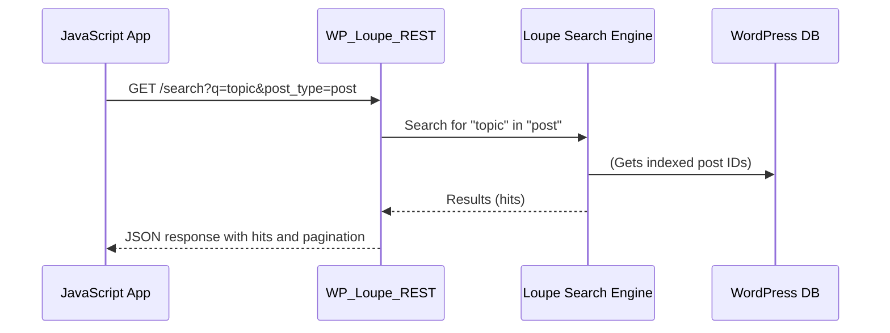

# Chapter 4: REST API Handler (WP_Loupe_REST)

_This chapter explains how apps, JavaScript, or other tools talk to Loupe behind the scenes via the REST API handler._

---

## Why Do We Need a REST API for Search?

Imagine you want to:

- Show live search results as the user types (AJAX).
- Build a custom admin UI that adjusts Loupe configuration without reloading the page.
- Connect another app, site, or script to your searchable content.

All of these need a _programming interface_—a structured “gate” so **software can interact with WP Loupe, not just humans through forms**.  
**This is the job of the** `WP_Loupe_REST` **handler.**

### Central Use Case

> **“I want to fetch search results from WP Loupe instantly using JavaScript. For example, when a user types something, I want to show live results in a dropdown.”**

---

## What Is a REST API? (For Beginners)

A **REST API** lets programs ask for data using simple web addresses (URLs), like:

```
GET https://yoursite.com/wp-json/wp-loupe/v1/search?q=wordpress
```

And get back JSON—a machine-readable response that apps or JavaScript can use right away.

---

## What Does WP_Loupe_REST Do?

It acts as an "API gatekeeper."  
**It exposes the main Loupe features as REST endpoints:**

- **Search**: Let apps/JavaScript fetch search results.
- **Discover Fields**: Let the admin UI learn which fields exist (for filter setup).
- **Manage Index**: Create or delete database structures for search.

---

## Key Features, Broken Down Simply

Let’s take them one by one:

### 1. Search Endpoint (`/search`)

*Input*:  
- `q` (your query)
- `post_type` (e.g. `post`, `page`, or `all`)
- `per_page`, `page` (how many results, and for which page)

*Output* (JSON):  
A neat list of posts, with title, URL, excerpt, type, and a score showing how relevant each result is.

#### Example

**Request:**

```
GET /wp-json/wp-loupe/v1/search?q=space&post_type=post&per_page=3&page=1
```

**Response (simplified):**

```json
{
  "hits": [
    { "id": 7, "title": "Space Launch", "url": "http://...", "excerpt": "A story about...", "_score": 42 },
    { "id": 13, "title": "The Final Frontier", "url": "http://...", "excerpt": "In space, no one...", "_score": 37 }
  ],
  "pagination": {
    "total": 20,
    "per_page": 3,
    "current_page": 1,
    "total_pages": 7
  }
}
```

**What happens:**  
With this, your JavaScript can fetch results as you type—super fast, never reloading the page!

---

### 2. Post Type Fields Endpoint (`/post-type-fields/{post_type}`)

*Purpose*:  
Let tools (like the settings UI) **discover all search fields (core & custom) for a specific post type**.

**Example:**

```
GET /wp-json/wp-loupe/v1/post-type-fields/post
```

Returns:

```json
{
  "post_title":   { "label": "Post Title" },
  "category":     { "label": "Category" },
  "price":        { "label": "Price" }
}
```

_Now the admin app can show all filter, sort, or weight options for you!_

---

### 3. Creating or Deleting Loupe Databases

*Endpoints*:  
- `/create-database` (POST, for setup)
- `/delete-database` (POST, to remove index for a post type)

Usually only used by the admin UI. No need for beginners to call these by hand, but they ensure the search “engine room” is ready.

---

## How Do You Use It as a Beginner?

You often **don't need to "call" these directly by hand** Most WordPress plugins, blocks, or admin panels do it for you:

- **Search forms or blocks** use JavaScript to “hit” `/search` in the background.
- **Settings UI** uses `/post-type-fields/...` to find out what fields to show.

#### A Minimal Example: Using JavaScript to Get Loupe Results

```js
// Say, inside your theme or a plugin:
fetch('/wp-json/wp-loupe/v1/search?q=stars&post_type=post')
  .then(res => res.json())
  .then(data => {
    // data.hits is your search result array!
    console.log(data.hits);
  });
```

**Result:**  
You get a live array of search hits matching "stars" from your posts!

---

## Step-by-Step: What Happens When You Call the REST API?

Let’s walk through **what happens behind the scenes**. Here’s a simple "search query" example:



### Plain-English Walkthrough

1. **User interacts (types in a search box) → JavaScript makes a request.**
2. **`WP_Loupe_REST` receives it, and asks the [Loupe Search Engine](06_wp_loupe_search_engine__wp_loupe_search_engine__.md) for results.**
3. **Loupe gets IDs of relevant posts.**
4. **`WP_Loupe_REST` enriches those with things like title, URL, excerpt, and bundles into a neat JSON reply.**
5. **JavaScript receives and shows results instantly!**

---

## Under the Hood: How Is This Built?

### REST Route Registration

The REST handler hooks into WordPress to register its endpoints as soon as REST is ready:

```php
add_action( 'rest_api_init', [ $this, 'on_rest_api_init' ] );
```

*This connects Loupe’s API routes with WordPress’s REST system.*

---

### Registering the Search Endpoint

```php
register_rest_route( 'wp-loupe/v1', '/search', [
  'methods' => 'GET',
  'callback' => [ $this, 'handle_search_request' ],
  'permission_callback' => '__return_true'
  // ... argument setup here ...
] );
```

>This means `/search` is live at `/wp-json/wp-loupe/v1/search`.  
No permissions needed for public search!

---

### Handling a Search Request

```php
public function handle_search_request( $request ) {
    $query = $request->get_param('q');
    $post_type = $request->get_param('post_type');
    // ... do search ...
    $results = $this->perform_search( $query, $post_type, ... );
    return rest_ensure_response( $results );
}
```

- Gets all needed search info from the URL/query.
- Calls `perform_search` (see next).

---

### Actually Performing a Search

```php
private function perform_search( $query, $post_type, $per_page, $page ) {
    $hits = $this->search_service->search( $query ); // Uses Loupe!
    // Filter, enrich, and paginate results...
    return [ "hits" => $paged_hits, "pagination" => ... ];
}
```

- Talks to [Chapter 6: WP Loupe Search Engine](06_wp_loupe_search_engine__wp_loupe_search_engine__.md) for the real results.

---

### Enriching Results (Formatting for Apps/JS)

```php
foreach ( $raw_hits as $hit ) {
  $enriched[] = [
    'id' => $hit['id'],
    'title' => get_the_title($hit['id']),
    'url' => get_permalink($hit['id']),
    // ... more ...
  ];
}
```

- Adds the info your JavaScript needs: titles, URLs, etc.

---

### Field Discovery Endpoint

When the admin (settings UI) needs to know available fields:

```php
register_rest_route( 'wp-loupe/v1', '/post-type-fields/(?P<post_type>[a-zA-Z0-9_-]+)', [
  'methods' => 'GET',
  'callback' => [ $this, 'handle_post_type_fields_request' ],
  'permission_callback' => function () { return current_user_can( 'manage_options' ); }
] );
```

- Responds only to admins.
- Returns a tidy list of all fields (built from post type, saved schema, and meta keys).

---

## Analogy: The Mailroom

Think of the **REST API Handler** as the office mailroom:

- **Apps, JavaScript, or UIs drop requests in the right slot (endpoint)**
- The handler figures out

---

Generated by [AI Codebase Knowledge Builder](https://github.com/The-Pocket/Tutorial-Codebase-Knowledge)