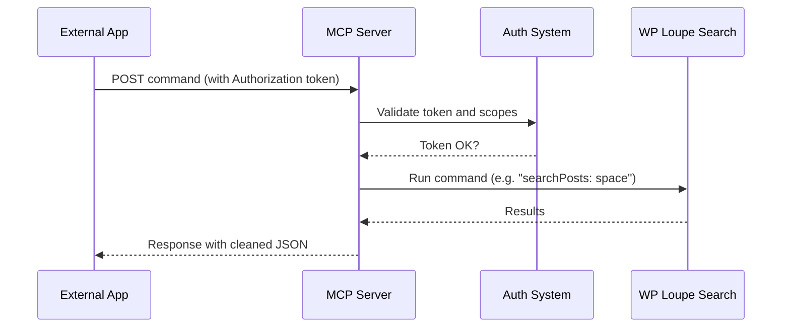

# Chapter 5: MCP Server (WP_Loupe_MCP_Server & related)

_Come from [Chapter 4: REST API Handler (WP_Loupe_REST)](04_rest_api_handler__wp_loupe_rest__.md)? Great! You’ve learned how apps and scripts talk to WP Loupe via REST APIs. Now, let’s unlock the “MCP Server”—a powerful, secure gateway for automation tools, AI agents, and integrations to connect to your WordPress search—in a way that’s safe, discoverable, and ready for scale._

---

## Why Do We Need the MCP Server?

**Central Use Case:**  
> "I want to let an AI assistant or external automation tool securely discover, search, and retrieve specific WordPress content (like posts and their schema) using safe, standardized commands—without exposing sensitive data or risking security."

If you want to connect your WordPress search to things like:
- **AI tools** (“Find me blog posts about space from last month!”)
- **No-code app builders** (“Show recent posts in Zapier!”)
- **Chatbots/agents** (“Can you summarize the latest news from my site?”)
- **Custom automations** (auto-update a dashboard or pipe search results into Google Sheets)

…you want more than just a “raw API.”  
You need something that is:
- **Discoverable**: How do outside apps find what’s available?
- **Secure**: Only allowed agents can search; access is controlled by tokens.
- **Structured**: Well-defined commands (not just “random” endpoints).
- **Rate limited**: No one can hammer your site endlessly.

The **MCP Server** is your WordPress search “librarian assistant”—it helps outside tools ask for exactly what’s allowed, safely and reliably.

---

## Key Concepts (In Plain English)

Let’s break down the main ideas behind MCP Server, so even non-programmers can follow:

### 1. **Auto-Discovery (`/.well-known/mcp.json`)**
Apps don’t want to “guess” what your site can do!
A special “manifest” file is automatically published at  
`https://your-site.com/.well-known/mcp.json`  
that lists supported MCP commands, endpoints, and abilities.

**Analogy:**  
Like putting out a menu outside a restaurant—the chef (WordPress) tells visitors (apps):  
_"Here’s what dinner you can order, and how to ask for it."_

---

### 2. **Secure Command Endpoint**
Instead of tens of random APIs, there’s ONE clear endpoint:  
`/wp-json/wp-loupe-mcp/v1/commands`  
Apps POST a JSON command (like “searchPosts”) with their token.  
The server reads their request, checks their permissions, and gives back safe, filtered results.

**Analogy:**  
Like a front desk librarian—guests must be allowed in, state what book they need, and get only what they’re allowed.

---

### 3. **Authentication (Tokens & OAuth)**
No anonymous access to sensitive actions!  
Apps must show an **access token** (like a guest pass), which limits them to just specific “scopes” (abilities: search, read posts, etc).

**Analogy:**  
Getting into a gym with a membership card—you can only do the things your card allows (work out, use pool; maybe not enter kitchen!).

---

### 4. **Rate Limiting**
To prevent spam or overload, MCP Server enforces rate limits.  
Limits are stricter for anonymous guests, and more generous for authenticated tokens.

**Analogy:**  
A fair system—no one person can check out 1000 books in a minute!

---

### 5. **Admin Controls & Monitoring**
Admins can enable or disable the MCP server, adjust limits, and create or revoke tokens—all in the WP Loupe settings.

---

## How Do You Use MCP Server? (Step-by-Step Guide)

Let’s walk through the central beginner use case:

---

### **A. Enable the MCP Server**

1. **Go to WordPress Admin → Settings → WP Loupe → MCP tab.**
2. **Check **“Enable MCP discovery manifest and command endpoint.”**
3. **Save settings.**

Now, your site publishes the manifest and can handle MCP commands!

---

### **B. Create a Secure Token (for your automation/app)**

1. **In the MCP tab**, scroll to **“Create New Token.”**
2. **Pick a label** (“AI Bot”, “Zapier App”, etc.).
3. **Select scopes** (what you want this token to allow: `search.read`, `post.read`, etc.).  
   - All checked by default for full read access.
4. **Set the expiration (TTL)**—for example, 24 hours or “never expires.”
5. **Generate the token**—it will show up once!

**Tip:** Copy this token somewhere safe (you’ll need it for your app).

---

### **C. Use the MCP Command Endpoint**

Your app or script will call:
**URL:** `/wp-json/wp-loupe-mcp/v1/commands`  
**Method:** POST  
**Headers:**  
- `Authorization: Bearer YOURTOKENHERE`

**Body Example—to search posts:**
```json
{
  "command": "searchPosts",
  "params": { "query": "space", "limit": 3, "fields": ["id", "title", "url", "excerpt"] }
}
```

**Sample response:**
```json
{
  "success": true,
  "data": {
    "hits": [
      { "id": 123, "title": "Space Launch", "url": "...", "excerpt": "..." }
    ],
    "pageInfo": { "nextCursor": null },
    "tookMs": 13
  }
}
```

_Your app gets clean, filtered results for just the query it's allowed to run!_

---

### **D. Other Commands Available**

Besides `searchPosts`, you can:
- `getPost` — fetch a single post’s data
- `getSchema` — get index field configuration
- `healthCheck` — check plugin/site status
- `listCommands` — see all supported commands

---

## Example: Issue a Token via WP-CLI (Advanced, Optional)

If you like using WP-CLI, you can create a token like this:

```shell
wp wp-loupe mcp issue-token --scopes="search.read post.read" --format=json
```

This prints out a usable token and info.

---

## What Happens Internally? (Step-by-step Walkthrough)

Here’s what goes on behind the scenes—let’s see it as a story.



**Explanation:**
- The app sends a command (“searchPosts”) with a token.
- MCP Server validates if the token is legit and allowed.
- If OK, it runs the search just like in [Chapter 6: WP Loupe Search Engine](06_wp_loupe_search_engine__wp_loupe_search_engine__.md).
- Results are filtered, sanitized, and sent back to the app.

If anything’s wrong (bad token, too many requests), the app sees a friendly error response!

---

## Deeper Dive—How does MCP Server validate & reply? (Code, Beginner Edition)

Let’s see actual steps in simple code.

### 1. **Handle Commands Endpoint (Minimal)**

```php
public function handle_commands_endpoint( $request ) {
    $auth = $this->maybe_authenticate(); // Check the token
    if ( is_wp_error($auth) ) return $this->error_response_from_wp_error($auth);

    $body = $request->get_json_params();
    $command = $body['command'] ?? null;

    // Example: If command is “searchPosts”, run search.
    if ($command === 'searchPosts') {
        $result = $this->command_search_posts($body['params'] ?? []);
        return $this->envelope_success([ 'data' => $result ]);
    }
    // ... handle other commands ...
}
```
_This checks your token, decides what command you want to run, and gives back a safe result._

---

### 2. **Token Validation (Super Simple Overview)**

```php
private function maybe_authenticate() {
    $header = $this->get_authorization_header();
    if ( ! $header ) return [ 'authenticated' => false ];
    if ( preg_match('/Bearer\s+(.*)$/i', $header, $m) ) {
        $token = trim($m[1]);
        return $this->oauth_validate_bearer($token);
    }
    return new WP_Error('invalid_token', 'Bad token');
}
```
_This checks if you sent the right kind of access token. If missing or wrong, you get a safe error._

---

### 3. **Search Command (Step-by-step)**
```php
private function command_search_posts($params) {
    $query = $params['query'] ?? '';
    $limit = $params['limit'] ?? 10;

    // Rate limiting happens here!

    // Run actual search:
    $hits = $this->search_engine->search($query); // Calls Loupe search

    // Paginate and format
    $window = array_slice($

---

Generated by [AI Codebase Knowledge Builder](https://github.com/The-Pocket/Tutorial-Codebase-Knowledge)