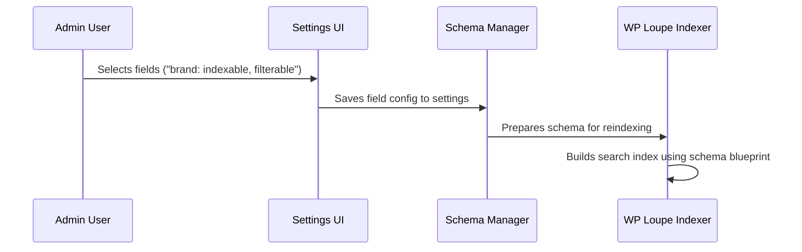

# Chapter 5: Schema Manager

Welcome! In the previous chapter, [MCP Server (Model Context Protocol)](04_mcp_server__model_context_protocol__.md), you learned how smart agents and apps can securely access your site's search functions. Now, let's explore the **Schema Manager** — the tool that decides *what* content is searchable and *how*.

---

## Motivation: Why "Schema Manager"?

Imagine you have a giant spreadsheet with many columns—like "Title", "Author", "Date", "Tags", "Ingredients", and "Price". When visitors search your site, do you want them to find matches in *all* these columns? Or only the important ones?

> **Use Case:**  
> "I want my visitors to be able to search by product titles and categories, filter by price, and sort by newest first—but I don't want irrelevant fields (like complex descriptions or random metadata) to get in the way or slow things down."

**Schema Manager** solves this by letting you pick ONLY the columns that matter for search, filtering, and sorting.  
Think of it as your site's *blueprint designer*—it draws the plan for which parts of your content are searchable or not.

---

## Key Concepts (Explained with Simple Analogies)

Let’s break down how the Schema Manager works:

| Concept         | Analogy / Friendly Explanation                                    |
|-----------------|-------------------------------------------------------------------|
| **Schema**      | The site’s search blueprint — a list of content fields (columns) and their rules. |
| **Field**       | One column, like "Title", "Price", "Date", "Tags", or "Recipe Ingredients". |
| **Indexable**   | Should this field be searched? (Is it searchable? E.g., "title" YES, "SKU" MAYBE.) |
| **Filterable**  | Can you filter results by this field? (E.g., "Price", "Category", "Cook Time".) |
| **Sortable**    | Can you order results by this field? (E.g., "Newest First", "Sort by Price".) |
| **Weight**      | How *important* is this field in search results? (Higher weight = higher ranking.) |

---

## How the Schema Manager Blueprint Solves Our Use Case

Let's solve the use case (searching products by relevant fields only):

#### Step 1: Pick the fields to include

- **Product Fields:**  
  - Title (indexable, weight: 2.0, sortable)
  - Category (indexable, filterable)
  - Price (indexable, filterable, sortable)
  - Description (indexable only)

#### Step 2: How does the Schema Manager set this up?

In WP Loupe, your schema for the `product` post type might look like:

```php
[
  'post_title'   => [
    'indexable'  => true,
    'weight'     => 2.0,
    'filterable' => false,
    'sortable'   => true,
    'sort_direction' => 'desc', // Newest first
  ],
  'taxonomy_category' => [
    'indexable'  => true,
    'weight'     => 1.5,
    'filterable' => true,
    'sortable'   => false,
  ],
  'price' => [
    'indexable'  => true,
    'weight'     => 1.0,
    'filterable' => true,
    'sortable'   => true,
    'sort_direction' => 'asc', // Cheapest first if sorted by price
  ],
  'description' => [
    'indexable'  => true,
    'weight'     => 1.0,
    'filterable' => false,
    'sortable'   => false,
  ],
]
```
*This schema acts as the "plan" for your site's search index.*

---

## Beginner-Friendly Example: How Do I Use Schema Manager?

Let's walk through *adding* a new field to your search blueprint.

### Pick a new custom field to index (e.g. "brand")

1. Go to **Settings → WP Loupe** in your admin dashboard.
2. Find your content type (e.g., "Products").
3. Click to make the "brand" field indexable and filterable.

#### What the input looks like in the UI:
```
+--------+-----------+--------+------------+----------+
| Field  | Indexable | Weight | Filterable | Sortable |
+--------+-----------+--------+------------+----------+
| brand  |    ✓      |  1.0   |    ✓       |    -     |
+--------+-----------+--------+------------+----------+
```

### What happens next?

- When a visitor searches for "Sony camera", matches in the **brand** field get included.
- You (or the API or a smart agent) can *filter results by brand*.
- If you set weight to "2.0", brand matches will be more important than description matches.

---

## How Schema Manager "Assembles" the Search Index (Internals, Step-by-Step)

Here’s an easy-to-follow sequence of what happens behind the scenes when Schema Manager sets the blueprint:



- You pick fields in the UI.
- Schema Manager saves your choices.
- The indexer uses the schema to create a *new search index*, containing ONLY those fields and their settings.

---

## Behind the Scenes: How Code Represents and Uses the Schema

Let's see how the Schema Manager works with simple code snippets (very simplified for learning):

### 1. Get the schema (blueprint) for a post type

```php
$schema_manager = WP_Loupe_Schema_Manager::get_instance();
$schema = $schema_manager->get_schema_for_post_type('product');
```
**Explanation:**  
This loads the blueprint for "product" — the fields and their indexable/filterable/sortable rules.

---

### 2. Use schema to figure out which fields are searchable, filterable, or sortable

```php
$searchable_fields = $schema_manager->get_indexable_fields($schema);
// Returns something like: [ ['field' => 'post_title', 'weight' => 2.0], ... ]

$filterable_fields = $schema_manager->get_filterable_fields($schema);
// Returns fields that users/apps can filter by

$sortable_fields = $schema_manager->get_sortable_fields($schema);
// Returns fields and sort direction (asc/desc) for ordering results
```
**Explanation:**  
These helper methods "slice" your blueprint, so the rest of WP Loupe knows what rules to follow when searching/filtering/sorting.

---

### 3. How does WP Loupe use these rules?

When you run a search, WP Loupe looks at your schema to:

- **Search only the fields you've allowed**.
- **Let filtering/sorting only on allowed fields** (so sorting by long content or weird metadata is avoided).
- **Give more importance (weight) to some fields**.

---

## Where Does the Schema Manager Store Its Blueprint?

All these settings are saved in the WordPress database (`wp_options` table) under names like `wp_loupe_fields`.

When the schema needs to change (you update settings), Schema Manager updates its *cache* and triggers a re-index so the search knows about the new blueprint.

---

## How to See/Modify Your Search Blueprint

- Use the admin UI (**Settings → WP Loupe → Fields Table**) to change what’s indexable, filterable, or sortable.
- The changes show up immediately the next time the search index is rebuilt (after you click "Reindex").

---

## How Does Schema Manager Work with Other Abstractions?

- The schema output gets used by the [Indexer & Document Preparation](06_indexer___document_preparation_.md) — the indexer consults the schema to know what fields to index.
- The REST API (see [REST API & Endpoints](03_rest_api___endpoints_.md)) uses schema info to allow only filterable/sortable fields for advanced queries.
- MCP Server ([MCP Server (Model Context Protocol)](04_mcp_server__model_context_protocol__.md)) relies on schema to describe available commands and data fields for smart agents.

---

## Wrapping Up

The **Schema Manager** is your search index's architect. It defines *what gets searched, how results are filtered and sorted, and which fields are most important.*  
With it, you can make WordPress search more relevant, more powerful, and much faster!

Now you're ready to see how WP Loupe takes your schema blueprint and *actually builds* the optimized index that powers lightning-fast searches.

👉 Move on to [Indexer & Document Preparation](06_indexer___document_preparation_.md) to learn how your content is transformed and indexed for speed!

---

---

Generated by [AI Codebase Knowledge Builder](https://github.com/The-Pocket/Tutorial-Codebase-Knowledge)