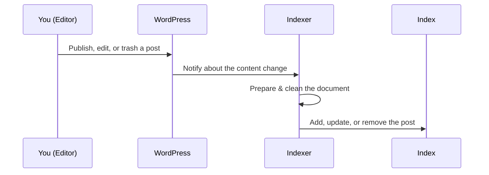

# Chapter 6: Indexer & Document Preparation

Welcome back! In the last chapter, [Schema Manager](05_schema_manager_.md), you learned how to choose **which fields of your content get indexed, filtered, and sorted**—you built your "search blueprint."

Now, let’s see how WP Loupe actually *uses* that blueprint to index your content and make search super fast.  
This is the job of the **Indexer** and **Document Preparation**!

---

## Why Do We Need an Indexer?

Imagine you’re managing a library. You have books delivered every day. To help visitors find them fast, you need to:

1. Catalog each new book (so it shows up in search)
2. Update the catalog if any book’s info changes
3. Remove books from the catalog if they’re removed from the shelves

The Indexer in WP Loupe does all this for your website’s content:

> **Central Use Case**  
> "I publish a new recipe post. I want it to be findable in search lines *right away*—and if I update it or delete it, search results should always stay up to date!"

WP Loupe’s Indexer collects and organizes all your posts (according to your schema), turning them into a **fast, optimized, searchable index**—so when users search, it’s lightning-fast.

---

## Key Concepts

Let’s break down how this works, step by step:

| Concept                  | Friendly Explanation                                          |
|--------------------------|--------------------------------------------------------------|
| **Indexer**              | The worker who builds and updates the search catalog         |
| **Document Preparation** | "Cleaning up" each post for storage (formatting, filtering)  |
| **Index**                | The super-fast catalog (database) built for searching        |
| **Reindexing**           | Rebuilding the entire catalog if your blueprint changes      |
| **Incremental Updates**  | Adding/removing/updating only one post in the index          |

---

## How Does the Indexer Work in Real Life?

### Everyday Actions

- **Add a new post:**  
  The Indexer instantly adds it to the search catalog.

- **Edit a post:**  
  The Indexer updates its entry.

- **Delete (or trash) a post:**  
  The post is immediately removed from the index.

- **Change your search blueprint (schema):**  
  The Indexer can rebuild (**reindex**) everything, so the catalog always matches your schema.

---

## Using the Indexer: A Beginner-Friendly Example

### Scenario: Publish a New Post

Suppose you add a new blog post called **"10-Minute Pasta"**.  
You want people to find it by searching for "pasta."

**What happens?**  
When you click “Publish,” WP Loupe’s Indexer:

- Prepares a document with the important data (title, content, ingredients, etc.)
- Adds it to the fast search index

#### Example code (simplified):

```php
$indexer = new WP_Loupe_Indexer();
$indexer->add($post_id, $post, $update);
```

**Explanation:**  
- `$post_id`—the ID of your new post  
- `$post`—the post object  
- `$update`—is this a new post, or an update?

**Result:**  
The new post is *immediately searchable*.  
If a user types "pasta" in the search box, it will show up!

---

### What If I Edit or Trash a Post?

#### Edit:

The Indexer will automatically update the corresponding entry in the index.

#### Trash/Delete:

```php
$indexer->trash_post($post_id, $previous_status);
```
**Result:**  
The post is instantly *removed* from the search index, so it won’t appear in search results.

---

### What If I Change the Fields to Be Indexed?

Suppose you add a new field "cuisine_type" to your blueprint in [Schema Manager](05_schema_manager_.md).

You’ll want to **reindex**:

```php
// For large sites, prefer batched reindexing (via Admin UI or WP-CLI)
// to avoid long-running requests.
$state = $indexer->reindex_batch_init();
while ( empty( $state['done'] ) ) {
  $state = $indexer->reindex_batch_step( $state, 500 );
}
```

**Result:**  
The entire catalog is rebuilt, now including the new field for all posts.  
No need to edit every post manually!

---

## How Does Document Preparation Work?

Before content is added to the index, it’s “cleaned up” and formatted so searches are accurate and perform well.

Here’s a simple version of how the Indexer prepares a post for indexing:

```php
function prepare_document($post) {
    return [
        'id' => $post->ID,
        'post_type' => $post->post_type,
        'post_title' => strip_tags($post->post_title),
        'post_content' => strip_tags($post->post_content),
        // ... add taxonomies, meta fields, etc.
    ];
}
```

**Explanation:**  
- Turns the WordPress post into a plain, clean document
- Only includes fields you’ve chosen in your schema
- Removes things like HTML (which isn’t needed for search)
- Handles custom fields, categories, etc.

If a field is *empty or not meant to be indexed*, it’s skipped.

---

## What Happens Under the Hood? (Step-by-Step)

Let’s look at a high-level view of what happens when you add, edit, or delete a post:



**Summary:**  
- WP Loupe listens to WordPress events  
- Prepares a clean document (only including allowed fields)
- Syncs changes with the fast search index

---

## Implementation Details (A Friendly Peek)

WP Loupe’s Indexer lives in  
**`includes/class-wp-loupe-indexer.php`**.

It works with the [Schema Manager](05_schema_manager_.md)  
to know exactly **which fields** to index.

### The Internal Magic

#### 1. Preparing a Document

```php
public function prepare_document($post) {
    $schema = $this->schema_manager->get_schema_for_post_type($post->post_type);
    $indexable_fields = $this->schema_manager->get_indexable_fields($schema);

    $document = [
        'id' => $post->ID,
        'post_type' => $post->post_type,
        // Add fields based on schema...
    ];
    // Only add allowed fields!
    // (Example: post_title, taxonomies, custom fields)
    return $document;
}
```

**Beginner Explanation:**  
- Gets your schema rules  
- Builds a new document, **only** including chosen fields

---

#### 2. Adding or Updating a Post

```php
$loupe = $this->loupe[$post->post_type]; // The search engine
$loupe->addDocument($document);
```

**Beginner Explanation:**  
- Puts your cleaned-up document into the search catalog

---

#### 3. Removing (Trashing) a Post

```php
$loupe->deleteDocument($post_id);
```

**Beginner Explanation:**  
- Instantly deletes the post from the index

---

#### 4. Reindexing All Content

```php
foreach ($posts as $post) {
    $doc = $this->prepare_document($post);
    $loupes[$post->post_type]->addDocument($doc);
}
```

**Beginner Explanation:**  
- Goes through **every** post, rebuilds the clean documents, and adds them to the index

---

## What About Upgrades and Migrations?

Sometimes, the WP Loupe engine itself changes and needs to update its catalog structure (for example, adding a column like `post_date`). The Indexer and its [Migration system](08_auto_update_and_migration_system_.md) handle this smoothly:

- If a new required field is missing, Indexer can *automatically* add it and rebuild the index.
- For big sites, rebuilding can be scheduled for later so your site doesn’t slow down.

---

## Summary & What's Next

- The **Indexer** is your automatic librarian! It keeps your site's search catalog in sync with your posts—whatever you add, change, or remove is instantly reflected in search.
- **Document Preparation** means only *clean, necessary data* goes into your search index, making results fast and relevant.
- When you change your [Schema Manager](05_schema_manager_.md) blueprint, just reindex to rebuild everything the right way.

**Ready to learn where and how all this indexed content is safely stored?**  
Head to the next chapter: [Database Management (WP Loupe DB)](07_database_management__wp_loupe_db__.md) where you’ll see how the search index works under the hood!

---

Continue your journey: [Database Management (WP Loupe DB)](07_database_management__wp_loupe_db__.md)


---

Generated by [AI Codebase Knowledge Builder](https://github.com/The-Pocket/Tutorial-Codebase-Knowledge)