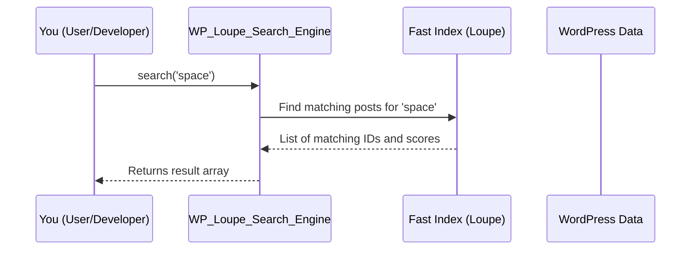

# Chapter 6: WP Loupe Search Engine (WP_Loupe_Search_Engine)

_Continue from [Chapter 5: MCP Server (WP_Loupe_MCP_Server & related)](05_mcp_server__wp_loupe_mcp_server___related__.md)? Awesome! You've just seen how secure automations and external tools can search your content. Now let’s see how **the magic searching actually works under the hood**, powering everything Loupe does: the WP Loupe Search Engine!_

---

## Why Does the "Search Engine" Matter?

Imagine someone asks your website,  
> “Show me all blog posts about space, newest first, and let me filter by author.”

**This is the chapter where all those search wishes come true!**  
The search engine is your site's “super-efficient librarian”—it understands questions, finds matching content in a split-second, and neatly ranks everything by importance.

### Central Use Case

> **"I need to find posts matching a search string—like all posts about 'space'—and show users the most relevant results instantly."**

---

## What Problem Does WP_Loupe_Search_Engine Solve?

- **Speed:** WordPress search can be slow. The Loupe engine is built for *instant* results, even on big sites.
- **Accuracy:** Results are based on smart ranking and your custom settings (like which fields matter most).
- **Safety:** It never changes or deletes your WordPress posts—just finds and ranks them.
- **Universality:** Works for every "customer": APIs, search forms, blocks, and automations.

---

## Key Concepts Explained for Beginners

Let’s break WP_Loupe_Search_Engine down into simple pieces:

### 1. **Search as a Function: No Side Effects**

- Think of it like a robot that *never* moves your books—only checks the card catalog and gives you an answer.
- **You can use it wherever you want:** the front end, custom APIs, automations, or even batch jobs.

### 2. **Indexed Search (not raw WordPress search)**

- Instead of looking through every post on the fly, it uses a special index (like a card catalog) in fast SQLite, prepared ahead of time ([see Chapter 7: Indexing & Document Preparation](07_indexing___document_preparation__wp_loupe_indexer.md)).
- **This makes searches lightning-fast!**

### 3. **Ranks Results by Relevance**

- Uses your field weights (from [Chapter 1](01_field_configuration_ui___settings__wploupe_settings_page__.md))—so if you say "title is most important," search honors that.
- Results are sorted from most to least relevant.

### 4. **Side-effect Free**

- **Never changes content**—just returns matches.
- Safe to call as often as you want, anywhere you need.

---

## How Do You Use WP_Loupe_Search_Engine?

You *don’t* need to write much code—just ask the search engine for matches!

### Minimal Example: Find Posts for a Query

```php
$engine = new WP_Loupe_Search_Engine(['post']); 
$results = $engine->search('space');
```

**What happens?**

- Finds all posts with “space” in title, content, or any field you chose to index.
- Orders them by relevance.
- Returns an array, each entry like:
    ```php
    [ 'id' => 123, '_score' => 42, 'post_type' => 'post' ]
    ```
  Plus whichever fields you chose to include.

**You can show these to users, or power API responses, etc.**

---

### Example Input/Output

- **Input:**  
    `search('cats')`
- **Output:**  
    ```php
    [
      [ 'id' => 7, '_score' => 22, 'post_type' => 'post' ],
      [ 'id' => 9, '_score' => 19, 'post_type' => 'post' ]
      // ...etc
    ]
    ```
- You can convert id → post using `get_post()` or `get_permalink()` if you need!

---

## How Does It Work, Step by Step?

Let’s walk through what happens when you call `search()`:



**Explanation:**
- You ask for matches using a search string.
- Engine tells the fast index to look for relevant documents.
- Index returns all the “hits,” **already ranked**.
- Engine hands back this tidy result array to you.

---

## How WP_Loupe_Search_Engine Knows "What to Search"

It uses "field weights" and settings **you chose** in  
[Chapter 1: Field Configuration UI & Settings](01_field_configuration_ui___settings__wploupe_settings_page__.md):

- Which post types
- Which fields (title, content, custom meta, etc.)
- Importance (weight) of each field

So, if you said “title matters most” and “category is filterable”, your search engine builds the query that way.

---

## Beginner-Friendly Code Walkthrough

Let’s look at the most important pieces—step by step:

### 1. Instantiate the Engine

```php
$engine = new WP_Loupe_Search_Engine(['post']);
```
**Makes a search engine for all `post` post types.**

---

### 2. Run a Search

```php
$results = $engine->search('space');
```
- **What happens inside?**
    - Looks up your indexed fields/settings.
    - Uses the Loupe library for instant, ranked matching.
    - Returns all "hits" (with post ID, score, and type).

**Tip:** The results aren't full posts—just data on what matched and how strong the match is.

---

### 3. Show Results (Convert to Posts for the Front End)

```php
foreach ($results as $hit) {
    $post = get_post($hit['id']);
    echo $post->post_title;
}
```
**So easy—just use the id to show your titles, links, etc!**

---

### 4. How Does It Decide What Fields to Use?

The engine reviews **your saved search settings** (from the admin UI):

```php
$this->saved_fields = get_option('wp_loupe_fields', []);
```
**So if you update field settings and click "Reindex," the engine starts using those new priorities right away!**

---

## Under the Hood: Internal Steps and Sequence

Let’s peek into how the engine actually runs:

1. **Builds Search Parameters:**  
   - Gathers fields, weights, filters, sorts based on your settings.
2. **Asks the Loupe Index:**  
   - Makes one query per post type.
3. **Combines Results & Sorts:**  
   - Merges all results and sorts by *score* (relevance).
4. **Caches Answers:**  
   - Stores responses in a fast cache to make repeated queries even quicker.

---

## Code Dive: Critical Methods (File: `includes/class-wp-loupe-search-engine.php`)

Let’s break down some key methods.

### Construct the Engine

```php
public function __construct( $post_types, $db = null ) {
    $this->post_types = (array) $post_types;
    // ...load db and settings...
    foreach ( $this->post_types as $post_type ) {
        $this->loupe[ $post_type ] = WP_Loupe_Factory::create_loupe_instance(...);
    }
}
```
**It gets ready to talk to the Loupe index for all your post types.**

---

### The Main Search Function

```php
public function search( $query ) {
    $hits = [];
    foreach ( $this->post_types as $post_type ) {
        // Prepare list of searchable/weighted fields by your config
        // ...
        $search_params = SearchParameters::create()
          ->withQuery((string)$query)
          ->withAttributesToRetrieve($retrievable_fields);
        // Run the actual search (Loupe does the work!)
        $result = $this->loupe[$post_type]->search($search_params);
        // Collect and merge the hits for all post types
        foreach ($result->toArray()['hits'] as $hit) {
            $hit['post_type'] = $post_type;
            $hits[] = $hit;
        }
    }
    return $hits;
}
```
**Explanation:**  
- For each post type, builds the search query.
- Passes along exactly the fields (and weights) you picked in the UI.
- Returns an array of raw matches.

---

### Caching for Speed

Search results are automatically cached behind the scenes so repeated queries don’t redo work:

```php
$cache_key = md5((string) $query . serialize($this->post_types));
$transient_key = "wp_loupe_search_{$cache_key}";
$cached_result = get_transient($transient_key);
if ($cached_result !== false) return $cached_result;
```
**Result:**  
- Next time someone searches for the same word, answers come back instantly from memory!

---

## How Is This Used By Other Parts?

- [**Hooks into default search**](02_search_integration_hooks__wp_loupe_search_hooks__.md): All default WordPress search forms (and blocks

---

Generated by [AI Codebase Knowledge Builder](https://github.com/The-Pocket/Tutorial-Codebase-Knowledge)