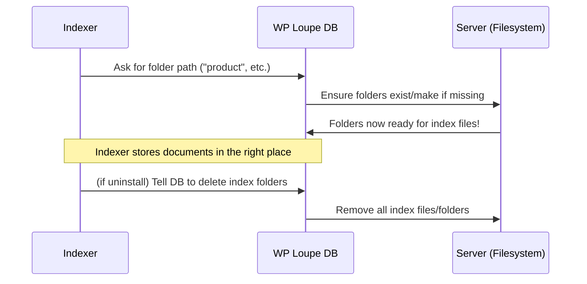

# Chapter 7: Database Management (WP Loupe DB)

Welcome back! In [Chapter 6: Indexer & Document Preparation](06_indexer___document_preparation_.md), you learned how WP Loupe turns your WordPress posts into clean, optimized "search documents"—and how the **Indexer** keeps that catalog up-to-date.

But here's a big question:

**Where do all these fast search indexes actually *live*? What organizes them? Who decides where the catalogs are stored on your server?**

This is where the **Database Management (WP Loupe DB)** system plays its part.

---

## Why Do We Need Database Management?

Think of your site as a library, and your search index as a set of card catalogs. But card catalogs need a physical place—maybe a special archive room or a storage closet.

> **Central Use Case:**  
> "I want the WP Loupe search engine to be fast and organized, and if I ever need to move, backup, reset, or clean up my site's search data, it should be easy and safe."

**Database Management** is like having a smart librarian who decides:
- *Exactly where* your card catalogs (the search index files) are stored.
- How to organize folders for each type of content.
- How to clean up or delete old indexes if you uninstall the plugin or start fresh.

---

## Key Concepts (Explained Simply)

Let's break down what Database Management (the "WP Loupe DB") actually does, using friendly analogies:

| Concept          | What It Means (Simple)                                                      |
|------------------|------------------------------------------------------------------------------|
| **Index Storage**  | The physical "room and shelves" where search data lives on your site (in files/folders, NOT the main database).        |
| **Base Path**      | The main directory where all search index data is kept (like the library's archive room).         |
| **Per-Type Folder**| Each post type (e.g., "post", "page", "product") gets its *own* folder for neatness.             |
| **Ensure Exists**  | The librarian creates folders and rooms if they don't already exist.                           |
| **Index Cleanup**  | Remove an index or the whole archive (for one type or everything) if you need to "start fresh". |


---

## How "WP Loupe DB" Solves Our Use Case (with a Simple Example)

Let's say you install WP Loupe and it starts helping you search your posts and pages.

**Where is the search index kept?**  
It's not in your main WordPress database. Instead, it's stored as files in a special directory, usually:

```
wp-content/wp-loupe-db/
```

Inside, you'll find folders for every post type you indexed:

```
wp-content/wp-loupe-db/post/
wp-content/wp-loupe-db/page/
wp-content/wp-loupe-db/product/   # If you index products
```

### What if you uninstall WP Loupe, or decide to clean up?

**Database Management** can safely remove the entire `wp-loupe-db` room and all its catalogs (files), so nothing is left behind.

---

## How to Use WP Loupe DB: Simple Examples

### 1. Get the Storage Path for a Post Type

Suppose you need to find out **where** the search index for "products" is stored:

```php
$db = WP_Loupe_DB::get_instance();
$path = $db->get_db_path('product');
echo $path;
```

**Output** (example):  
`/your-site/wp-content/wp-loupe-db/product`

**Beginner Explanation:**  
- Creates or gets the Database Manager.
- Asks "Where do you keep the product index?"  
- It makes the folder if it doesn't exist!

---

### 2. Delete the Whole Search Index (Cleanup)

If you want to delete ALL search index files (maybe before uninstalling):

```php
$db = WP_Loupe_DB::get_instance();
$db->delete_index();
```

**What happens:**  
- The `wp-content/wp-loupe-db/` folder and everything inside it are removed.
- Your site's search data is wiped—usually as part of plugin uninstall.

---

### 3. Where are These Methods in Code?

All this logic lives in:

- **`includes/class-wp-loupe-db.php`** (Database Management logic)
- **`uninstall.php`** (Safely deletes search data when you uninstall WP Loupe)

---

## Internal Walkthrough: How Does It Work Behind the Scenes?

Here’s an overview—what happens when WP Loupe needs to store or clean up your search index.



**Explanation:**  
- The **Indexer** always asks WP Loupe DB where to store index files, so it's never guessing.
- WP Loupe DB makes folders as needed, keeps everything organized by post type.
- If you uninstall or delete, DB handles all the cleanup!

---

## Beginner-Friendly Code Snippets

### a) Getting the Base Index Path

```php
$db = WP_Loupe_DB::get_instance();
$base = $db->get_base_path();
```

**Result:**  
Gets the main folder where all of WP Loupe’s search data lives.

---

### b) Making Sure a Folder Exists

This is done automatically! But inside, it looks a bit like:

```php
// This is run only if a folder’s missing:
if (!is_dir($path)) {
    mkdir($path, 0755, true);
}
```

**Explanation:**  
- If a folder for your index doesn’t exist, WP Loupe DB creates it.
- Permissions are set so WordPress can read and write data.

---

### c) Deleting Index Folders (as on uninstall)

From the uninstall script:

```php
$file_system = new WP_Filesystem_Direct(false);
if ($file_system->is_dir($cache_path)) {
    $file_system->rmdir($cache_path, true);
}
```

**Explanation:**  
- Checks if the wp-loupe-db folder exists.
- Deletes it and everything inside in one step.
- Leaves your server nice and tidy!

---

## How Does This Connect to the Rest of WP Loupe?

- [Indexer & Document Preparation](06_indexer___document_preparation_.md) asks the DB where to store/fetch index files.
- Search queries go through the index files organized and managed by WP Loupe DB.
- [Auto-Update and Migration System](08_auto_update_and_migration_system_.md) uses DB management when indexes need to be rebuilt or moved.

---

## Key Takeaways

- **WP Loupe DB** keeps your search data safe, organized, and isolated from your main content.
- Every indexed post type goes in its own folder, making things easy to back up or manage.
- Cleanly wipes indexes when you uninstall or clean up—no files left behind.

---

## On to the Next Chapter!

Now that you know where and how WP Loupe stores your search indexes, you’re ready to learn how WP Loupe automatically updates, migrates, and keeps your search database up to date as your site changes.

Continue your learning journey in: [Auto-Update and Migration System](08_auto_update_and_migration_system_.md)

---

---

Generated by [AI Codebase Knowledge Builder](https://github.com/The-Pocket/Tutorial-Codebase-Knowledge)