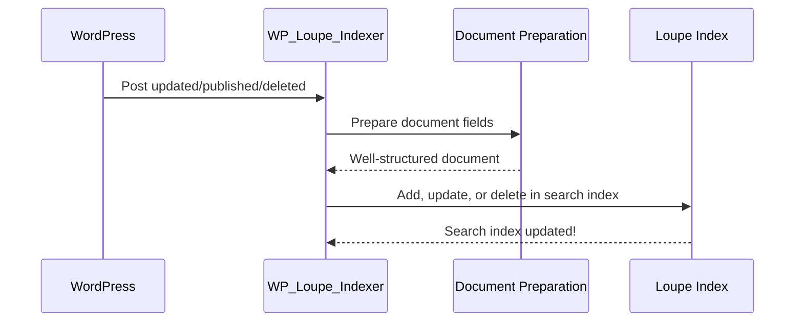

# Chapter 7: Indexing & Document Preparation (WP_Loupe_Indexer)

*Continue from [Chapter 6: WP Loupe Search Engine (WP_Loupe_Search_Engine)](06_wp_loupe_search_engine__wp_loupe_search_engine__.md)*

---

## Why Does "Indexing & Document Preparation" Matter?

Imagine you just published a new blog post—or updated an old one. You want your search to show this post instantly, with the right title, categories, and even custom info.  
**But how does WP Loupe’s search always stay up to date, even as your WordPress site changes?**

**Central Use Case:**
> “I want every new, updated, or deleted post to show up (or disappear) in search results—*right away*—and always be formatted correctly for powerful searching and filtering.”

This is the exact job of the **Indexing & Document Preparation system**, led by `WP_Loupe_Indexer`.  
If your search index is your library’s card catalog, then the **indexer is the super-organized librarian** who makes sure every book is correctly filed, updated, or removed, so anyone can find them instantly.

---

## Key Concepts (Explained Simply)

Let’s break down what the Indexer does in beginner-friendly steps:

### 1. **Live Updating: Never Out-of-Date**
Whenever you add, edit, or delete a WordPress post or page, the indexer instantly updates your search index. **No waiting, no “stale” results.**

### 2. **Bulk Reindexing: Handle Big Changes**
If you change which fields are indexed or you update schema settings, the indexer can *rebuild the whole index* for all posts — so your search always matches your latest setup.

### 3. **Document Preparation: Getting Posts “Ready to Search”**
It carefully formats each post with the right fields (like title, categories, custom meta) so they can be searched, filtered, and sorted.

### 4. **Schema Change Handling: Adapts to New Fields**
If you add a new field or make an old one sortable/filterable, the indexer updates the index to match *without breaking anything*.

### 5. **Deletion Sync: Removes Unpublished Content**
Any deleted or trashed post is instantly removed from the search index—*no stray results!*

---

## How Do You Use WP_Loupe_Indexer?

**Most of the time, you don’t need to write code!**  
WP Loupe handles all the hard work for you, quietly working in the background.  
Here’s how the most common workflows look:

### **A. Automatic Updates (No Action Needed!)**

- Publish, update, or delete any post or page.
- WP Loupe Indexer detects the change and updates the search index—*instantly!*

### **B. Manual Bulk Reindexing (For Field/Schema Changes)**

When you change field configuration (e.g., make "category" filterable):
1. Go to **Settings > WP Loupe** in your WordPress admin.
2. Click the **Reindex** button.
3. The indexer rebuilds the entire search index for your configured post types.

> **Result:** All changes are live, and future searches use your newest settings.

---

## Example: Adding a Post—What Happens?

Suppose you publish a new post about “Space Launches”.

**Here’s what the indexer does:**
- Notices the new post is published.
- Prepares the document with all indexed fields (title, category, date).
- Adds it to the Loupe search index.
- Future searches for “space” instantly show this new post!

---

### Minimal Code Example: Indexing a Post

```php
// Indexer listens for post publishing
add_action('save_post_post', [$indexer, 'add'], 10, 3);

// Indexing function
public function add( $post_id, $post, $update ) {
    if ( ! $this->is_indexable( $post_id, $post ) ) { return; }
    $document = $this->prepare_document( $post );
    $this->loupe[ $post->post_type ]->addDocument( $document );
}
```
**Explanation:**  
- Whenever you save a post, the indexer checks if it should be searchable (“indexable”).
- It prepares all the fields (title, category, etc.) using `prepare_document`.
- Adds it to the Loupe index: *now your search sees it instantly!*

---

## Example: Bulk Reindex After Schema Change

Say you decided to make a new field "filterable" in the Loupe settings.

**What happens when you click "Reindex"?**

```php
// Admin triggers reindex
public function reindex_all() {
    foreach ( $this->post_types as $post_type ) {
        $posts = get_posts([ 'post_type' => $post_type, 'post_status' => 'publish', 'posts_per_page' => -1 ]);
        $documents = array_map([ $this, 'prepare_document' ], $posts);
        $this->loupe[ $post_type ]->deleteAllDocuments();
        $this->loupe[ $post_type ]->addDocuments( $documents );
    }
}
```
**Explanation:**  
- Fetches all posts for each post type.
- Wipes the old index.
- Rebuilds it from scratch, using your new field configuration!

---

## Example: Removing a Deleted Post from Search

If you trash a post, the indexer removes it from the search index *immediately*:

```php
// Detect trashed post
add_action('wp_trash_post', [$indexer, 'trash_post'], 10, 2);

public function trash_post( $post_id, $prev_status ) {
    if ( $prev_status !== 'publish' ) { return; }
    $this->delete( $post_id );
}
```
**Explanation:**  
- As soon as you move a post to trash, it’s gone from search—*no lingering results!*

---

## Internal Implementation: What Happens Step-by-Step?

Let’s visualize the process when you update a post:


**Plain English:**  
- When a post changes, the indexer handles it.
- Prepares the document, formatting all info properly.
- Updates the Loupe index so searches always show current content.

---

## How Does Document Preparation Work? (Beginner-Friendly)

The indexer makes sure every “searchable document” is clean, standardized, and complete, with all needed info.

**Here’s a simplified version:**

```php
public function prepare_document( $post ) {
    $doc = [ 'id' => $post->ID, 'post_type' => $post->post_type ];

    if ( isset( $post->post_title ) )
        $doc['post_title'] = wp_strip_all_tags( $post->post_title );

    // Example: Add category taxonomy as array of names
    $terms = wp_get_post_terms( $post->ID, 'category', [ 'fields' => 'names' ] );
    if ( ! empty($terms) )
        $doc['taxonomy_category'] = $terms;

    // Add meta fields if configured...

    return $doc;
}
```
**Explanation:**  
- Starts with basic fields (ID, type).
- Adds title (sanitized), categories, and any extra fields.
- Ensures only valid, non-empty data is indexed.

---

## Schema Changes & Migrations: How Does Indexer Stay Up-to-Date?

Sometimes, Loupe adds new fields or a settings change means your index needs a rebuild.  
The Indexer handles this reliably—*even if you upgrade Loupe or change your field configuration.*

**Migration Helper:**

```php
private function ensure_required_columns() {
    // For each post type, make sure required columns (like post_date) exist in the SQLite index
    // If missing, add columns and create indexes
}
```
**Explanation:**  
- Quietly updates your index storage so nothing breaks.
- If a field is missing, it adds it and rebuilds the index.

---

## When Should You Manually Reindex?

- After changing field settings (making a field indexable, filterable, or sortable).
- After installing a Loupe update that adds new features.
- If search results look incorrect.

**Just click “Reindex” in WP Loupe settings!**

---

## File References (For the Curious)

- Core class:  
  `includes/class-wp-loupe-indexer.php`
- Entry point:  
  Constructed by plugin loader:  
  `includes/class-wp-loupe-loader.php`
- Schema helper:  
  `includes/class-wp-loupe-schema-manager.php`
- Migration logic:  
  `includes/class-wp-loupe-migration.php`

---

## Analogy: The Super Librarian

Imagine your favorite library:
- The librarian always puts new books on the right shelves,
- Updates book details when something changes,
- Removes bad or outdated books,
- And reorganizes the shelves whenever the system says so.

WP Loupe Indexer is your site’s **super librarian**, keeping search results sharp, accurate, and current—all the time.

---

## In Summary: What Did You Learn?

- **WP_Loupe_Indexer

---

Generated by [AI Codebase Knowledge Builder](https://github.com/The-Pocket/Tutorial-Codebase-Knowledge)