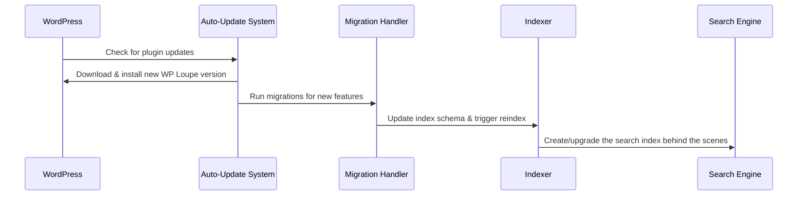

# Chapter 8: Auto-Update and Migration System

Welcome back! In [Chapter 7: Database Management (WP Loupe DB)](07_database_management__wp_loupe_db__.md), you learned where and how WP Loupe stores its fast search indexes behind the scenes.

But here's another real-world challenge:

> **Central Use Case:**  
> "As time goes on, I want my website's search engine to automatically update the plugin when there are improvements, AND smartly adjust or upgrade its indexes so search never breaks—even if my schema or WP Loupe itself changes!"

This is where the **Auto-Update and Migration System** comes in.  
Think of it as your search engine's *personal butler*, making sure everything is always fresh, up-to-date, and upgraded quietly in the background!

---

## Why Is This System Important?

Imagine if every time you upgraded your search plugin, you had to manually rebuild all your indexes, figure out if new fields needed adding, or fix broken searches because something changed.

The Auto-Update and Migration System:
- **Checks for plugin updates automatically** and installs them if you want.
- **Migrates the search index**—so if internal data changes, or new features are added, your search keeps working perfectly.
- **Smooths transitions**: everything is handled quietly, so your site search *never* breaks after an upgrade.

---

## Key Concepts Made Easy

Let’s break down what this system does, using real-life analogies:

| Concept              | Explanation (Friendly)                                                  |
|----------------------|-------------------------------------------------------------------------|
| **Auto-Update**      | Like your phone updating its apps—WP Loupe checks for new versions and upgrades itself, so you always have the latest and greatest! |
| **Migration**        | Imagine your library adding a new card catalog shelf; migration means WP Loupe updates your search database structure so it fits new features. |
| **Schema Upgrade**   | If WP Loupe adds a new field (column) to be indexed, migration adjusts everything so searches don’t break. |
| **Safe Reindexing**  | If big changes are needed, WP Loupe rebuilds your search index so all your posts are ready for advanced searching, with no downtime. |

---

## How Do You Use The Auto-Update and Migration System?

### 1. Auto-Updates: Stay Current, Effortlessly

**By default**, WP Loupe will automatically update itself like a helpful robot.

You can control this:
- **Disable auto-update** by adding this line to `wp-config.php`:
  ```php
  define('WP_LOUPE_DISABLE_AUTO_UPDATE', true);
  ```
  *This stops automatic plugin updates if you ever want manual control.*

- **Enable/disable from settings:**  
  Go to **Settings → WP Loupe → Advanced**. Use the auto-update switch.

#### How does it work under the hood?

```php
add_filter( 'auto_update_plugin', function($update, $item){
    // Enable auto-update for WP Loupe unless disabled
    if ($item->plugin === WP_LOUPE_NAME) return true;
    return $update;
}, 10, 2 );
```
**Beginner explanation:**  
When WordPress checks for plugin updates, this filter *asks for WP Loupe to be auto-updated!*  
If you opt out, it skips the update just for this plugin.

---

### 2. Migration: Keeping Your Index Up-to-Date

Suppose WP Loupe adds a new feature (like sorting by post date).  
A migration ensures your **search index** matches the new features.

**What happens automatically:**
- WP Loupe notices your existing index doesn't have the new column.
- It updates its schema and triggers a *safe reindex* (either right away for small sites, or scheduled for bigger sites).

#### Example code (simplified):

```php
// Check for new field "post_date"
$fields = get_option('wp_loupe_fields', []);
foreach ($fields as $pt => &$pt_fields) {
    if (!isset($pt_fields['post_date'])) {
        $pt_fields['post_date'] = [
            'indexable' => true,
            'filterable' => true,
            'sortable' => true,
            'sort_direction' => 'desc',
            'weight' => 1.0,
        ];
    }
}
// Save updated fields
update_option('wp_loupe_fields', $fields);
```

**Beginner explanation:**  
After an upgrade, WP Loupe *adds the new required field* to every post type, so searches keep working!

##### If the index structure itself changes…

```php
// Schedule a reindex for all posts
if ($total_posts <= 2000) {
  $indexer->reindex_all(); // For small sites: rebuild now
} else {
    wp_schedule_single_event( time()+30, 'wp_loupe_migration_reindex', [ $post_types ] );
}
```
**Beginner explanation:**  
Small sites get their search index rebuilt instantly; large sites let WordPress handle it gently in the background!

For manual reindexing on large sites, WP Loupe also supports **batched reindexing** from the Settings UI and via WP-CLI (`wp wp-loupe reindex`).

---

### 3. Manual Control (Advanced Users)

If you ever want to opt-out of auto-migrations or auto-reindexing, you can:
- Add to `wp-config.php`:
  ```php
  define('WP_LOUPE_DISABLE_AUTO_REINDEX', true);
  ```
- **Manually trigger a reindex** in the WP Loupe settings (or call code like `$indexer->reindex_all()`).

For large sites, prefer **batched** reindexing via Settings → WP Loupe → Reindex, or WP-CLI:

```sh
wp wp-loupe reindex
```

---

## What Happens Internally? (Step by Step Walkthrough)

Let’s see, in simple steps, **what happens when a new WP Loupe version is installed**:



**Explanation:**  
- WordPress checks for updates and pulls in the new plugin version.
- The Migration system scans your index—if new fields or features are present, it upgrades everything.
- The Indexer rebuilds the search catalog so you can use the new features, with nothing breaking!

---

## Under The Hood: Reference Implementation

Where does this logic live?

- **Auto-update logic:**  
  [`includes/class-wp-loupe-auto-update.php`](includes/class-wp-loupe-auto-update.php)
- **Migration routines:**  
  [`includes/class-wp-loupe-migration.php`](includes/class-wp-loupe-migration.php)

#### Key auto-update snippet:

```php
add_filter('auto_update_plugin',
    function($update, $item) {
        if ($item->plugin === WP_LOUPE_NAME)
            return !defined('WP_LOUPE_DISABLE_AUTO_UPDATE');
        return $update;
    }, 10, 2
);
```
*Sets up auto-update unless the admin disables it.*

#### Key migration snippet (simplified):

```php
function ensure_post_date_field(){
    $fields = get_option('wp_loupe_fields', []);
    // If missing, add post_date to each post type
    // ... then update_option() and trigger reindex
}
```
*Checks for needed changes, then triggers an index update so everything runs smoothly.*

---

## How Does This System Connect to Other WP Loupe Parts?

- **Database Management ([Chapter 7](07_database_management__wp_loupe_db__.md)):**  
  The migration system works within the special WP Loupe index folders, never touching your regular WordPress data.
- **Indexer ([Chapter 6](06_indexer___document_preparation_.md)):**  
  Uses the indexer to safely rebuild all search documents after an upgrade.
- **Schema Manager ([Chapter 5](05_schema_manager_.md)):**  
  Adjusts your schema (search blueprint) during migrations so new features always work.

---

## Wrapping Up: Your Search, Always Fresh!

With the **Auto-Update and Migration System**, your WP Loupe-powered website search is:
- **Always up-to-date:** Plugin improvements installed without effort.
- **Always working:** Index automatically upgraded, so search never breaks.
- **Quietly maintained:** Like a butler, all technical chores happen in the background!

---

Up next: Learn how WP Loupe diagnoses issues and offers helpful utilities in [Utilities & Diagnostics](09_utilities___diagnostics_.md).

---

---

Generated by [AI Codebase Knowledge Builder](https://github.com/The-Pocket/Tutorial-Codebase-Knowledge)