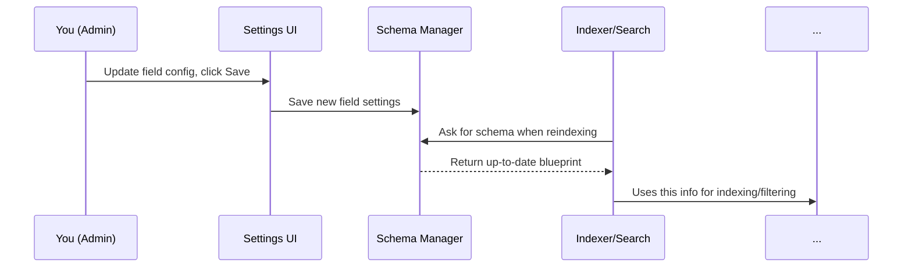

# Chapter 8: Schema Manager (WP_Loupe_Schema_Manager)

_Continue from [Chapter 7: Indexing & Document Preparation (WP_Loupe_Indexer)](07_indexing___document_preparation__wp_loupe_indexer.md). Now that your content is always up-to-date in the search index, let’s learn how WP Loupe always knows **what fields to expect, how they should be searched, and what’s filterable or sortable**. This is the job of the Schema Manager!_

---

## Why Does the Schema Manager Matter?

Imagine you’re running a library, and you need to tell your staff:

- **What information is tracked for each book** (title, author, genre, etc.)
- **Which details are searchable or filterable**
- **How much weight each detail gets in search results**
- **How to stay up-to-date when anything changes**

Without clear "rules of the library," people can't find the right books, and you might get errors or missing info.

**Central Use Case:**

> "I want my search to always work—even when I add a new custom field, change which fields are filterable, or update what’s most important for search relevance. I need WP Loupe to always understand 'what a post looks like' and how to handle it!"

That’s exactly what `WP_Loupe_Schema_Manager` does:  
It’s your search’s “blueprint manager,” making sure every part of your search engine always understands what is inside your content.

---

## Key Concepts (Explained Simply)

Let’s break the Schema Manager into easy ideas:

### 1. **Schema = Blueprint for Each Post Type**

A "schema" is basically a list describing:
- Each field (like "title", "category", "price")
- What kind of data it is
- Should it be indexed, filterable, sortable?
- What "weight" it has for search relevance

_Think of it as the list your helpers use to know exactly what to look for in each book._

---

### 2. **Schema = Single Source of Truth**

Instead of every tool guessing what’s in a post, **everyone asks the Schema Manager**.  
If you add a field or change settings, all parts of WP Loupe stay in sync.

---

### 3. **Schema is Cached for Speed**

Schemas (the blueprints) are cached in memory so everything stays super-fast, but if you change your settings, the cache is cleared and everyone uses the new version immediately.

---

### 4. **Customizable by Admins (and Developers)**

You decide (in settings) which fields are included, how important they are, which are filterable/sortable, etc.

- The Schema Manager turns your choices into a "blueprint" that everything else uses!

---

### 5. **Special Powers for Taxonomies and Custom Fields**

It understands "core" fields (title, date), taxonomy fields (like categories/tags), and custom fields (like "price" or "location")—treats them all as part of your schema, so nothing gets missed.

---

## How Do You Use Schema Manager? (Beginner’s View)

**Good news:**  
As a user, you mostly *don’t interact with the Schema Manager directly*.

Instead, you:

1. **Choose which fields to index/filter/sort, and set weights** in the [Field Configuration UI](01_field_configuration_ui___settings__wploupe_settings_page__.md).
2. **Click “Reindex”** in the WP Loupe settings page whenever your field settings change.

And under the hood?  
WP Loupe’s Schema Manager builds an up-to-date blueprint, and every other part of the plugin (like the [Indexer](07_indexing___document_preparation__wp_loupe_indexer.md) and [Search Engine](06_wp_loupe_search_engine__wp_loupe_search_engine__.md)) always uses it!

---

### Example: What Does a Schema Look Like?

**Imagine you set these options for "post" type:**

| Field       | Indexable | Weight | Filterable | Sortable |
|-------------|-----------|--------|------------|----------|
| post_title  | ✓         | 2.0    |            | ✓        |
| post_date   | ✓         | 1.0    |            | ✓        |
| category    | ✓         | 1.0    | ✓          |          |
| price       | ✓         | 1.5    | ✓          | ✓        |

**Your schema (blueprint) for "post" would look like:**

```php
[
  'post_title' => [
    'weight' => 2.0, 'indexable' => true, 'sortable' => true
  ],
  'post_date' => [
    'weight' => 1.0, 'indexable' => true, 'sortable' => true
  ],
  'category' => [
    'weight' => 1.0, 'indexable' => true, 'filterable' => true
  ],
  'price' => [
    'weight' => 1.5, 'indexable' => true, 'filterable' => true, 'sortable' => true
  ]
]
```

*This means every time a post is indexed, searched, or filtered, the system uses exactly this guide!*

---

## How the Schema Manager Keeps Everything in Sync

Whenever you update field settings in the UI:
- The Schema Manager reads the _latest_ version.
- Caches (memory copies) are cleared so all new actions use the updates.
- The Indexer and Search Engine check in with Schema Manager for the latest rules.

---

## Beginner-Friendly Example: Using Schema Manager Internally

Suppose [Indexing & Document Preparation](07_indexing___document_preparation__wp_loupe_indexer.md) needs to know what fields to include for "post". It might do:

```php
$schema_manager = new WP_Loupe_Schema_Manager();
$schema = $schema_manager->get_schema_for_post_type('post');
```

**Explanation:**  
- Asks the Schema Manager: "What’s the blueprint for posts right now?"

---

To get JUST the filterable fields:

```php
$filterable_fields = $schema_manager->get_filterable_fields($schema);
```

**Explanation:**  
- Gets a list like `['category', 'price']` if only those fields are filterable.

---

## Internal Implementation: What Happens Step-by-Step?

Whenever another part of WP Loupe (like the Indexer or Search Engine) needs the current "rules" for a post type, here’s what happens:



**Plain English:**
- You set your preferences in the UI.
- Schema Manager saves the choices and (optionally) clears its cache.
- When Indexer/Search Engine needs info, Schema Manager always supplies the latest blueprint.

---

## Code Snippets: Core Methods (Simplified)

All code lives in `includes/class-wp-loupe-schema-manager.php`.

### 1. Get Schema for a Post Type

```php
public function get_schema_for_post_type( string $post_type ): array {
    // Build schema based on saved config for $post_type
    // Cache for speed, clear when changed
    return $this->schema_cache[$post_type];
}
```
**Explanation:**  
Returns blueprint for a post type, including weights and filter/sort status for each field.

---

### 2. Get All Indexable Fields

```php
public function get_indexable_fields( array $schema ): array {
    // Return list of fields where 'indexable' is true
}
```
**Use case:**  
Indexer uses to know what to include when preparing each document.

---

### 3. Get All Filterable/Sortable Fields

```php
public function get_filterable_fields( array $schema ): array {
    // Only fields marked as filterable
}

public function get_sortable_fields( array $schema ): array {
    // Only fields marked as sortable
}
```

**Use case:**  
Block UI retrieves this to know which filters/sort options to show visitors!

---

### 4. Clear Cached Schema When Settings Change

```php
public function clear_cache(): void {
    $this->schema_cache = [];
    $this->fields_cache = [];
}
```
**Explanation:**  
Ensures next fetch gets the latest version.

---

## Analogy: “The Library’s Rule Book”

**Schema Manager** is like the master rulebook for your library.

- The *settings UI* is the head librarian writing down what’s important.
- The *Schema Manager* copies the latest rulebook for all the staff.
- *Indexers* and *search assistants* always check the rulebook before doing anything!
- If the head librarian changes rules, the old copies are thrown out and new ones are distributed instantly.

---

## Summary & What’s Next

- The Schema Manager is your search engine’s **blueprint keeper and rulebook**—it ensures every part of WP Loupe knows **what your content looks like** and how fields should be handled.
- You control the schema in the field settings UI; Schema Manager turns those choices into “the rules” used everywhere: indexing, searching, filtering, and sorting.
- If you change the schema, the cache is cleared so new rules are always followed—and your search works

---

Generated by [AI Codebase Knowledge Builder](https://github.com/The-Pocket/Tutorial-Codebase-Knowledge)