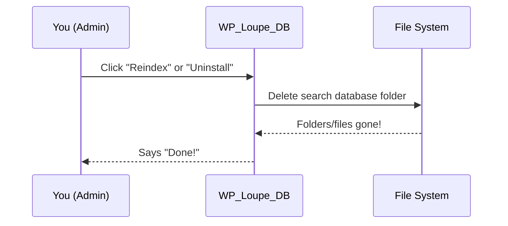

# Chapter 9: Database Management (WP_Loupe_DB)

_Continue from [Chapter 8: Schema Manager (WP_Loupe_Schema_Manager)](08_schema_manager__wp_loupe_schema_manager__.md). You now understand how WP Loupe knows "what" is in your search index. But where is all that precious search data actually stored? And how does Loupe keep all those files tidy, organized, and ready to use?_

---

## Why Is Database Management Important?

Imagine Loupe’s search index as a library’s *backroom storage*: You need a safe, neat place to keep the card catalog for every type of book (posts, pages, etc).  
If any room (database) is missing or messy, search won’t work, and your visitors won’t find what they need!

### **Central Use Case**

> “I want each post type (like, ‘posts’ and ‘pages’) to have its own fast search database, safely tucked away in a folder, ready to be cleaned up or rebuilt as needed—no manual file handling!”

This is exactly the role of **`WP_Loupe_DB`**:  
It’s Loupe’s *shelf-builder and caretaker*—making sure every post type gets its own storage space, checking that rooms (directories and files) are created, cleaned up, or deleted as needed.

---

## Key Concepts (Breakdown for Beginners)

Let’s explore the basic ideas!

### 1. **A Separate “Room” (File) for Every Post Type**

- Each post type (like “post”, “page”, or “product”) gets its own database file on disk.
- These files live safely inside a dedicated folder (by default: `wp-content/wp-loupe-db`).
- This keeps everything clean, organized, and independent—boosting speed and avoiding data “mix-ups”.

### 2. **Automatic Folder and File Creation**

- Loupe checks: Does the database directory exist? If not, it quietly creates it—no file errors!
- It always ensures files and folders are there _before_ they’re used—no surprises.

### 3. **Clean-Up and Rebuilding**

- When you “reindex” or uninstall, Loupe can *delete* all search database files and folders, so you don’t leave behind “junk”.
- You never need to poke around your server with FTP.

### 4. **Customizable Database Location**

- Advanced users or hosts can choose a different folder using a WordPress filter.
- This means you can move your Loupe databases outside the regular content folder if you want.

---

## How Do I Use Database Management in WP Loupe?

**Good news!**  
For most users, you **don’t need to do anything manually**—Loupe takes care of everything for you.

Here’s what “just works” out of the box:

- When you first enable Loupe, the `wp-content/wp-loupe-db` folder is created automatically.
- When you add a post type to search, its database folder and file appear automatically.
- If you click “Reindex” (or uninstall Loupe), all Loupe search index files are safely and cleanly deleted.

### Example: What Happens When I Add a New Post Type?

Suppose you add a custom post type, "event", in Loupe’s settings.

**Loupe will:**
- Create a folder for "event" inside `wp-content/wp-loupe-db`
- Create the actual database file inside that folder (e.g., `wp-content/wp-loupe-db/event/loupe.db`)
- Ensure everything is in place before trying to write any data.

---

## Beginner-Friendly Code Examples

You usually **don’t call these methods directly**—Loupe does it automatically.

But here’s what the abstractions look like, in simple code:

### A. Get the Folder for All Loupe Databases

```php
$path = WP_Loupe_DB::get_instance()->get_base_path();
```

**Explanation:**  
Gets the main storage “room” for _all_ Loupe databases (usually: `wp-content/wp-loupe-db`).

---

### B. Get the Folder for a Specific Post Type

```php
$event_path = WP_Loupe_DB::get_instance()->get_db_path('event');
```

**Explanation:**  
Finds (and creates if needed) the folder for the "event" post type.  
_This is where its Loupe search file lives!_

---

### C. Delete the Entire Search Index (Cleanup)

```php
WP_Loupe_DB::get_instance()->delete_index();
```

**Explanation:**  
Deletes all Loupe database files and folders.  
_This is used during “Reindex” or uninstall for a fresh start!_

---

## What Happens Under the Hood? (Step-by-Step)

Let’s see a “story” of what happens if you reindex or uninstall.



**Explanation:**
- You take action from Loupe’s admin UI
- Loupe tells the DB manager: “Clean out everything, please”
- DB manager safely deletes all search files/folders for every post type.

---

## Internal Implementation (File References + Key Methods)

All lives in:  
**`includes/class-wp-loupe-db.php`**

### 1. Create or Get the Main Database Folder

```php
public function get_base_path() {
    $default = WP_CONTENT_DIR . '/wp-loupe-db';
    $path = apply_filters( 'wp_loupe_db_path', $default );
    $this->ensure_directory_exists($path);
    return $path;
}
```

**Explanation:**  
- Chooses a default folder, but lets others override with a filter.
- *Always* makes sure the folder exists—so no error messes.

---

### 2. Create or Get the Post Type Folder

```php
public function get_db_path($post_type) {
    $base_path = $this->get_base_path();
    $path = $base_path . '/' . $post_type;
    $this->ensure_directory_exists($path);
    return $path;
}
```

**Explanation:**  
- Gets (or creates) a sub-folder for each post type, keeping things tidy.

---

### 3. Delete the Whole Index

```php
public function delete_index() {
    $file_system = new \WP_Filesystem_Direct(false);
    $cache_path = $this->get_base_path();
    if ($file_system->is_dir($cache_path)) {
        return $file_system->rmdir($cache_path, true);
    }
    return true;
}
```

**Explanation:**  
- Tries to delete the main database folder—recursively (removes all subfolders too).
- Used for full clean up on uninstall, or if you reindex everything.

---

### 4. Move the Database (Advanced)

You (or a dev) can filter the location:

```php
add_filter('wp_loupe_db_path', function($path) {
    return '/custom/location/wp-loupe-db';
});
```

**Explanation:**  
- This moves all Loupe databases to a custom folder (e.g., on a different drive or backup area).

---

## Analogy: The Caretaker of the Storage Rooms

Think of WP_Loupe_DB as the facility manager in a giant library:

- Assigns a special storage room for every kind of book (post type),
- Makes sure no room is left out or missing,
- Sweeps out all the rooms if you remodel or move out,
- Lets the head librarian (Loupe) decide where to move the room if needed (custom location).

Everything is *automatic*. You just focus on using search!

---

## What About Security and Permissions?

- Loupe’s database folders live *outside* your main uploads and plugin folders, keeping things tidy.
- All database management uses safe WordPress APIs, so you never need to touch file permissions manually.
- If you uninstall Loupe, all database files are **safely deleted** (see `uninstall.php`).

---

## In Summary

- **WP_Loupe_DB** is the builder and caretaker for all your Loupe search databases.
- It creates, ensures, and deletes folders/files so your search “just works” and files are always tidy.
- You almost never need to touch these folders yourself; Loupe does it all for you automatically.

Ready to dig into some utility tricks and “power user” helpers?  
Continue to [Chapter 10: Factory & Utilities (WP_Loupe_Factory, WP_Loupe_Utils)](10_factory___utilities__wp_loupe_factory__wp_loupe_utils__.md)!

---

---

Generated by [AI Codebase Knowledge Builder](https://github.com/The-Pocket/Tutorial-Codebase-Knowledge)