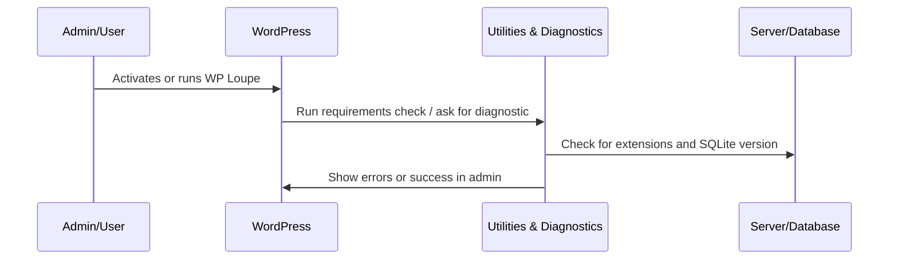

# Chapter 9: Utilities & Diagnostics

Welcome! In [Chapter 8: Auto-Update and Migration System](08_auto_update_and_migration_system_.md), you learned how WP Loupe keeps itself up-to-date and adapts automatically as your site or the plugin changes.

Now, let's talk about the **"handy toolbox"** behind the scenes: the **Utilities & Diagnostics** abstraction.

---

## Why Do We Need Utilities & Diagnostics?

**Central Use Case:**  
*"I'm setting up WP Loupe, but something's not quite working. How do I check if all requirements are met, get a quick diagnostic, fix common issues, or see why something's broken without being a WordPress expert?"*

WP Loupe’s utility and diagnostic tools are like your site’s **“health check kit and toolbox”**. They help you:
- Check that your website/server meets all WP Loupe requirements (like the right database version).
- Log or debug issues during setup or development.
- Get quick version and environment info for support.
- Clean up search caches when things don’t look right.

All this makes sure WP Loupe runs smoothly in your WordPress environment!

---

## Key Concepts, Explained Simply

Let’s break down what "Utilities & Diagnostics" provides:

| Concept                          | Friendly Explanation                                                                                      |
|-----------------------------------|----------------------------------------------------------------------------------------------------------|
| **Requirements Check**            | Makes sure your server has everything needed (like a recent version of SQLite and some PHP extensions).  |
| **Diagnostic Line**               | Shows a summary of your environment’s health (requirements: OK or missing).                             |
| **Debug Logging**                 | Quietly writes detailed info to a log so you (or support) can see what's happening under the hood.       |
| **Version Reporting**             | Lets you see exactly what version of WP Loupe is running.                                                |
| **Helper Methods (e.g. cache clearing)** | Simple tasks like clearing search-related caches, all in one click or command.                        |

---

## Solving Our Use Case: Health Check & Troubleshooting

### 1. **Check: Is Everything Set Up Correctly?**

When you activate WP Loupe, it automatically checks:

- Is the *PDO SQLite* driver installed?
- Is the database a new enough version?
- Do you have the "intl" and "mbstring" PHP extensions (helpful for advanced search features)?

If *anything is missing or too old*, WP Loupe will **show a clear error in your WordPress admin** and deactivate itself (to prevent confusion).

#### Example: What You'll See

```
[Error] SQLite PDO driver not available
WP Loupe requires the pdo_sqlite extension and SQLite version 3.35.0 or newer.
```

---

### 2. **Diagnostic Line: Quick Requirements Report**

Want a *fast summary* ("Is my site ready?") from the admin dashboard?

```php
$diagnostic = WP_Loupe_Utils::get_requirements_diagnostic_line();
echo $diagnostic;
```

**Output Example:**  
```
Requirements: pdo_sqlite=yes; SQLite=3.42.0 (>= 3.35.0): OK; intl=yes; mbstring=yes
```

> This means all requirements are met—if anything says "MISSING/OLD," you know what to fix.

---

### 3. **Debug Logging: What Went Wrong?**

If you're developing or troubleshooting, you might want to write debug messages.

```php
WP_Loupe_Utils::debug_log("Indexer started reindexing.");
```
- **When `WP_DEBUG` is enabled**, this writes a message like:
  ```
  [WP Loupe] Indexer started reindexing.
  ```
  to your server's PHP error log.

---

### 4. **Quick Version Check**

You might need to know exactly which version of WP Loupe you're running (for support or troubleshooting):

```php
$version = WP_Loupe_Utils::get_version_number();
echo $version;
```
**Output:**  
```
1.3.2
```

---

### 5. **Clear Search Caches (Transients)**

Sometimes you want to **clear old search caches**—maybe if you changed settings or indexed new posts and want to flush what's in memory.

Just run:

```php
WP_Loupe_Utils::remove_transient('wp_loupe');
```
**Result:**  
- Quickly removes all cached search results with the given prefix.
- Your search results will be rebuilt fresh on the next search.

---

## How Does This Work Behind The Scenes?

Let’s walk through the most important steps using a simple flow.



- When you activate the plugin, utilities check all requirements.
- If something’s missing, a clear error is displayed and the plugin deactivates itself.
- If all is well, WP Loupe continues working.
- Optional: You (or the UI) can view the diagnostic line anytime.

---

## Beginner-Friendly Internal Code Examples

### 1. **Check for Required Database and Extensions**

```php
if (!class_exists('\\PDO') || !extension_loaded('pdo_sqlite')) {
    // Show error & deactivate plugin
}
```
**Explanation:**  
- If the PDO or SQLite driver is missing, WP Loupe cannot run, so you get a specific error message.

---

### 2. **Report Environment Status**

```php
$ok = version_compare($sqlite_version, '3.35.0', '>=');
if ($ok) {
    echo 'SQLite version OK!';
} else {
    echo 'SQLite too old!';
}
```
**Explanation:**  
- Compares your server’s SQLite version with the required one.

---

### 3. **Show an Admin Notice with Error and Auto-Deactivate**

```php
add_action('all_admin_notices', function () {
    echo '<div class="notice notice-error">...</div>';
    deactivate_plugins( WP_LOUPE_FILE );
});
```
**Explanation:**  
- When something required is missing, you see a *big red box* with an error and the plugin disables itself to keep things safe.

---

### 4. **Clear All Search-Related Caches (Transients)**

```php
$matches = self::get_transients(['search' => $prefix]);
foreach ($matches as $match) {
    delete_transient($match->option_name);
}
```
**Explanation:**  
- Finds all cached search results with a matching prefix and deletes them, so WP Loupe generates new fresh results.

---

### 5. **Minimal Debug Logging**

```php
if (defined('WP_DEBUG') && WP_DEBUG) {
    error_log('[WP Loupe] Something happened!');
}
```
**Explanation:**  
- Logs messages only if WordPress debug mode is on, so prod sites aren’t cluttered with debug info.

---

## Where Can I Find These Utilities in The Code?

All these handy helper methods are inside:

- `includes/class-wp-loupe-utils.php`

And you *don’t* have to call them directly—WP Loupe calls them automatically when needed. But knowing they exist helps you troubleshoot or extend if you build plugins or custom integrations.

---

## How Do Utilities & Diagnostics Link to Other Abstractions?

- The [Database Management (WP Loupe DB)](07_database_management__wp_loupe_db__.md) and [Indexer & Document Preparation](06_indexer___document_preparation_.md) depend on Utilities to ensure the right database engine is available before building search indexes.
- [Auto-Update and Migration System](08_auto_update_and_migration_system_.md) uses diagnostic checks before and after auto-upgrading.
- If something goes wrong in any part of WP Loupe, Utility logging helps you (and support) diagnose problems.

---

## Wrapping Up

**In this chapter, you learned:**
- How WP Loupe’s utility and diagnostic tools check the site’s compatibility and health.
- How you, or the plugin, can quickly report version, requirements, or debug info.
- How to clear search caches or logs when troubleshooting.

**Bottom line:** These tools are your friendly “check engine light” and “first aid kit” for keeping WP Loupe—and your search—running smoothly!

You’re now ready for the final piece: how WP Loupe **boots up, loads, and initializes itself** in WordPress.  
👉 Continue your journey in the last chapter: [Loader & Initialization](10_loader___initialization_.md)


---

Generated by [AI Codebase Knowledge Builder](https://github.com/The-Pocket/Tutorial-Codebase-Knowledge)