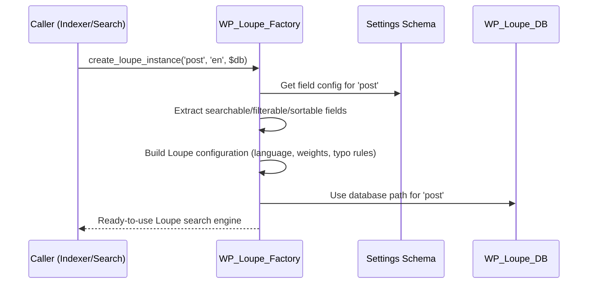

# Chapter 10: Factory & Utilities (WP_Loupe_Factory, WP_Loupe_Utils)

_Continue from [Chapter 9: Database Management (WP_Loupe_DB)](09_database_management__wp_loupe_db__.md). Now that you understand how WP Loupe keeps its database files neat and organized, let’s discover the "machinery room" and helpful tools that make the whole plugin run smoothly and reliably!_

---

## Why Do We Need Factories & Utilities?

Imagine you run a car factory.  
Every car needs to be put together exactly right (correct engine, wheels, options)—so you use a **factory** to ensure they're built to spec.

Meanwhile, to keep the factory running, you have a toolbox for:
- Checking if the power is on
- Diagnosing problems
- Cleaning up dust
- Tuning machines for different speeds

**In WP Loupe:**
- The **Factory** builds ready-to-use search engines (one per post type), always using the latest blueprint (schema) and settings.
- **Utilities** provide helpful tools—like requirement checks, logging, and cleanup—that keep everything running smoothly behind the scenes.

---

## Use Case: Why Might I Care?

> “I want every supported post type (like `post` or `product`) to have its own fast, correctly-configured search—even if I change languages, fields, or search options later. Also, I never want weird errors if my server is missing PHP pieces or gets cluttered with old caches.”

WP Loupe solves this with:
- A **Factory** that always creates the right kind of search “engine” for each job.
- Easy-to-understand **Utilities** that detect requirements, clean cache, and prevent errors.

---

## Key Concepts (Broken Down Simply)

Let’s break these big words into friendly pieces!

### 1. The Factory: “Build My Search Engine, Please!”

**WP_Loupe_Factory** is the master mechanic.  
Its job is:  
- Given a post type (like `post` or `product`), and settings (language, field choices),  
- Build a **search engine instance** that’s _just right_ for the job.

It makes sure:
- The right fields are set up to be searched, filtered, or sorted
- The engine honors language/typo settings
- Nothing is built “wrong”—avoiding bugs!

**Analogy:**  
Think of demanding a new taxi—"I want one that's blue, runs on electric, and has leather seats." The factory does all the work—and you get a ready-to-use taxi!

---

### 2. Utilities: “Handy Tools For a Healthy System”

**WP_Loupe_Utils** is your helpful toolbox.  
Its powers include:
- Checking if your server has everything you need (like the right version of SQLite)
- Logging important debug information (so advanced users can diagnose issues)
- Cleaning up old cache data (“cleaning the machinery room”)
- Safely removing temporary storage (so things never get cluttered)
- Protecting you from mistakes (like running Loupe on an unsupported server)

**Analogy:**  
It’s like having a dashboard, broom, warning lights, and a checklist—all in one!

---

## How to Use the Factory & Utilities (Beginner Style)

### Example: Creating a Search Engine Instance For a Post Type

Suppose Loupe needs a search instance for "post"—the factory is called:

```php
$instance = WP_Loupe_Factory::create_loupe_instance('post', 'en', $db);
```
**What happens?**
- You get a fast, fully-configured Loupe search engine _just_ for your posts.
- All current field settings (from settings UI) are included automatically.

You don’t call this directly unless you’re a developer—but every time a search runs, _this_ is what happens in the background!

---

### Example: Checking Requirements (Will Loupe Work On My Site?)

In the admin, Loupe wants to check if your server is compatible:

```php
$is_ok = WP_Loupe_Utils::has_sqlite();
```
**What happens?**
- Loupe double-checks your PHP extensions—the plugin will stop with a friendly warning if missing anything critical.
- Keeps your site safe from confusing errors!

---

### Example: Cleaning Up Old Search Cache (Transients)

Advanced: Sometimes you want to clear out old saved search results:

```php
WP_Loupe_Utils::remove_transient('wp_loupe_search_');
```
**What happens?**
- Loupe finds all cache entries (transients) matching that prefix and deletes them, removing “search dust bunnies” from your site.

---

## Under the Hood: How Does the Factory Work?

Let’s visualize what happens step by step when the Factory is called:



**Plain English:**
- The Factory reads your current settings, extracts info about which fields can be searched/sorted, and sets up the engine.
- It hands back a "super-charged" search engine ready to go!

---

## Code Peek: How Factory & Utilities Work Internally

### WP_Loupe_Factory (File: `includes/class-wp-loupe-factory.php`)

**Main Method:**

```php
public static function create_loupe_instance($post_type, $lang, $db) {
    // 1. Get current field configuration for the post type
    // 2. Figure out which fields to search/filter/sort
    // 3. Add typo/language settings from options
    // 4. Build a configuration object for Loupe
    // 5. Create and return a Loupe instance (using $db location)
    // 6. Cache so future calls are fast!
}
```
**Beginner Explanation:**  
This method wraps up ALL the “which fields, what language, how to sort” logic and builds a search engine the right way—no mistakes.

---

**Bonus: Is This Field Safely Sortable?**

```php
public static function check_sortable_field($field_name, $post_type) {
    // Checks if this field is ok for sorting (e.g., is it a number or a word?)
}
```
**Why?**  
Some fields (like "title" or "price") are safe for sorting. Others (like "content" or categories) are not.

---

### WP_Loupe_Utils (File: `includes/class-wp-loupe-utils.php`)

**Checking System Requirements:**

```php
public static function has_sqlite() {
    // Checks for PDO, pdo_sqlite, correct SQLite version
    // Shows error & disables Loupe if missing!
}
```
**Beginner Explanation:**  
Before Loupe runs, it checks your server isn't missing anything. No more "it doesn't work but I don't know why" headaches.

---

**Removing Old Search Cache (“Transients”):**

```php
public static function remove_transient($prefix) {
    // Finds and deletes any cache keys that start with this prefix
}
```
**Beginner Explanation:**  
- Keeps things fast and tidy—if something gets stuck, you can clean up.

---

**Diagnostics Helper:**

```php
public static function get_requirements_diagnostic_line() {
    // Shows a quick line for admins, like:
    // "pdo_sqlite=yes; SQLite=3.35.2: OK; intl=yes; mbstring=yes"
}
```
**Why?**  
So you can quickly see if your site is ready for Loupe (no scary command line needed!).

---

## Analogy Time!

- **The Factory** is your dedicated "search engine builder"—bring it specs, it delivers a perfectly-tuned engine.  
- **The Utilities** are your “health kit” and “cleaning crew”—they stop breakdowns before they start.

---

## In Summary

- The **Factory** ensures every search engine Loupe creates is built perfectly to your settings, for each post type and language.
- The **Utilities** keep your plugin healthy—automatically checking requirements, cleaning up, and keeping things reliable.
- These pieces are the “invisible glue” that keep everything running smoothly—for beginners and power users alike.

Ready for more?  
You’ve now explored all the core machinery of WP Loupe!  
**Feel free to return to any chapter in this guide whenever you want to understand a specific part in detail.** Now go forth and build awesome searches!

---

---

Generated by [AI Codebase Knowledge Builder](https://github.com/The-Pocket/Tutorial-Codebase-Knowledge)