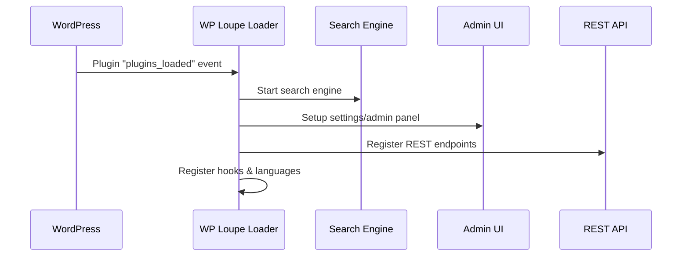

# Chapter 10: Loader & Initialization

Welcome to the final chapter!  
In [Chapter 9: Utilities & Diagnostics](09_utilities___diagnostics_.md), you learned how WP Loupe keeps itself healthy and how to quickly check, debug, or fix the search system.

Now, let's uncover the magic behind WP Loupe's **Loader & Initialization**—the "master switch" that powers everything up!

---

## Motivation: Why "Loader & Initialization"?

Imagine your WordPress site as a big theater. You have actors (the search engine, the indexer, the REST API, settings, diagnostics), all ready to perform. But before the show starts, you need a conductor who:

- Brings everyone to the stage in the right order
- Turns on the lights and sound
- Checks that the script is ready
- Makes sure every part knows when to act

**WP Loupe's Loader** does this job. Without it, search features, admin settings, updates, and REST endpoints wouldn't start properly—your site would be "dark"!

> **Central Use Case:**  
> "I want WP Loupe’s search, admin panel, REST API, upgrades, and diagnostics to *all work together seamlessly*, without me doing anything extra."

Let’s see how Loader & Initialization makes that happen!

---

## Key Concepts (Explained Simply)

Let's break down what happens behind the scenes:

| Concept              | Analogy / Friendly Explanation                                              |
|----------------------|-----------------------------------------------------------------------------|
| **Loader**           | The conductor—brings all components together and flips the main ON switch.  |
| **Initialization**   | The power-up sequence—sets up languages, hooks, and components in order.    |
| **Dependency Loading** | Grabbing all the needed scripts, actors, and tools for the show.         |
| **Component Initialization** | Starts the key systems: search engine, indexer, REST, admin UI.    |
| **Hook Registration**| Wires up connections so WordPress knows about Loupe's features.            |

---

## How Loader & Initialization Solves the Use Case

### What happens when you activate WP Loupe?

- All core systems boot up: search, admin panel, index management, REST API, MCP server, diagnostics.
- All settings, endpoints, and hooks are registered automatically.
- You don't need ANY manual setup—search works out of the box!

---

## Using Loader & Initialization: A Beginner Walkthrough

**You don’t need to call Loader directly!**  
Just install & activate WP Loupe. The Loader does all the hard work for you:

- Detects the WordPress environment
- Checks for required PHP/database features
- Powers up the **search engine**, **admin UI**, **indexer**, **REST API**, **diagnostics**, and more

**What shows up for you?**
- A working search box (super fast)
- An admin panel for search settings
- REST endpoints for external apps
- MCP server for secure automation
- Diagnostic messages if anything is missing

No extra code required!

---

## Internal Implementation: What Happens Step-by-Step?

Let’s peek under the hood with a simple step-by-step:



**Plain English:**  
- WordPress triggers the Loader when plugins load.
- Loader powers up all parts in order: search, admin UI, REST, hooks, diagnostics.
- All the searching, filtering, and advanced features are now live!

---

## Example: Minimal Loader Usage (How Initialization Works)

**File:** `wp-loupe.php`  
This is the plugin’s main bootstrap.

**Key snippet:**

```php
require_once WP_LOUPE_PATH . 'includes/class-wp-loupe-loader.php';

function init() {
    WP_Loupe_Loader::get_instance();
    // ... checks requirements, starts up everything ...
}
add_action('plugins_loaded', __NAMESPACE__ . '\\init');
```

**Explanation:**  
- When “plugins_loaded” fires, the Loader is created.
- Loader’s constructor brings up all the other components.

---

### Inside the Loader: How Components Are Started

**File:** `includes/class-wp-loupe-loader.php`

**Part 1: Grabbing all dependencies**
```php
private function load_dependencies() {
    require_once WP_LOUPE_PATH . 'includes/class-wp-loupe-search-engine.php';
    require_once WP_LOUPE_PATH . 'includes/class-wp-loupe-indexer.php';
    // ... (Rest of the components)
}
```
*Explanation: This loads all the code for each main part: search, indexer, admin UI, REST API, diagnostics, etc.*

---

**Part 2: Powering up each component**
```php
private function init_components() {
    $this->search_engine = new WP_Loupe_Search_Engine($this->post_types);
    new WPLoupe_Settings_Page(); // Admin UI
    new WP_Loupe_REST(); // REST endpoints
    WP_Loupe_MCP_Server::get_instance(); // MCP server
    $this->indexer = new WP_Loupe_Indexer($this->post_types);
}
```
*Explanation: Starts each main feature, ready for WordPress to use.*

---

**Part 3: Wiring up hooks and language support**
```php
private function register_hooks() {
    add_action('init', [ $this, 'load_textdomain' ]);
}

public function load_textdomain() {
    load_plugin_textdomain('wp-loupe', false, dirname(plugin_basename(WP_LOUPE_FILE)) . '/languages');
}
```
*Explanation: Makes WP Loupe ready for translations, proper admin interface, and future actions.*

---

## How Does Loader & Initialization Link to Other Abstractions?

- It powers up the [Search Engine](01_wp_loupe_search_engine_.md) for finding content.
- It starts [Settings & Admin UI](02_settings___admin_ui_.md) for search setup.
- It launches [REST API & Endpoints](03_rest_api___endpoints_.md) for external access.
- It bootstraps [MCP Server](04_mcp_server__model_context_protocol__.md) for secure automation.
- It runs the [Indexer & Document Preparation](06_indexer___document_preparation_.md) to keep your search index in sync.
- It checks all [Utilities & Diagnostics](09_utilities___diagnostics_.md) to make sure everything is healthy.

---

## Summary: Your All-in-One Starter!

**Loader & Initialization** brings together **everything** you learned so far:
- Ensures WP Loupe and all its features are ready for WordPress.
- No need for manual tweaks—just activate and search!

You’ve reached the end of your beginner’s guide to WP Loupe.  
Your WordPress search is now powerful, fast, and ready for anything.

**Want a refresher?**  
Jump back into any chapter above to revisit core features:

- [WP Loupe Search Engine](01_wp_loupe_search_engine_.md)
- [Settings & Admin UI](02_settings___admin_ui_.md)
- [REST API & Endpoints](03_rest_api___endpoints_.md)
- [MCP Server (Model Context Protocol)](04_mcp_server__model_context_protocol__.md)
- [Schema Manager](05_schema_manager_.md)
- [Indexer & Document Preparation](06_indexer___document_preparation_.md)
- [Database Management (WP Loupe DB)](07_database_management__wp_loupe_db__.md)
- [Auto-Update and Migration System](08_auto_update_and_migration_system_.md)
- [Utilities & Diagnostics](09_utilities___diagnostics_.md)

**Thank you—and happy searching with WP Loupe!** 🚀

---

Generated by [AI Codebase Knowledge Builder](https://github.com/The-Pocket/Tutorial-Codebase-Knowledge)