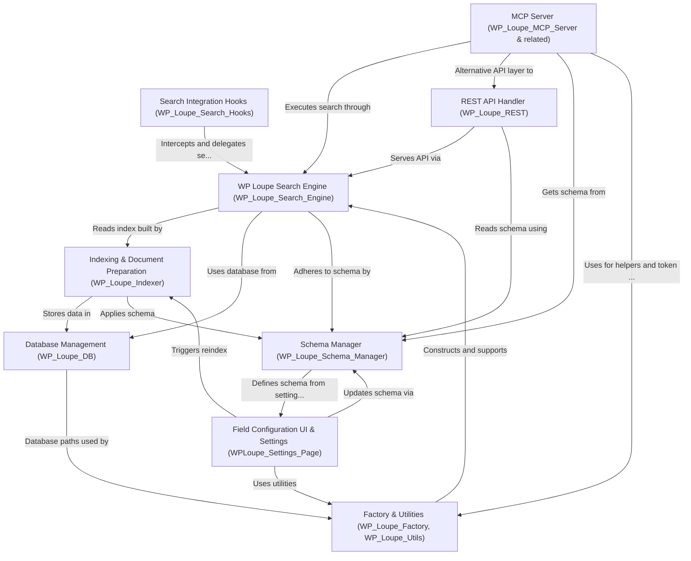

# Tutorial: wp-loupe

**WP Loupe** is a *powerful search enhancement plugin for WordPress*.
It replaces the default site search with a **high-speed, relevant, and filterable search**—using a custom SQLite-powered index under the hood.
With **WP Loupe**, you can *fine-tune what content is indexed, configure filters/sorting, and securely expose search via REST API and machine (AI) interfaces (MCP)*.
The plugin is designed for both beginners who want *faster, better results* and developers/integrators who need advanced search APIs and automation.

**Source Repository:** [https://github.com/soderlind/wp-loupe](https://github.com/soderlind/wp-loupe)

## Chapters

1. [Field Configuration UI & Settings (WPLoupe_Settings_Page)
](01_field_configuration_ui___settings__wploupe_settings_page__.md)
2. [Search Integration Hooks (WP_Loupe_Search_Hooks)
](02_search_integration_hooks__wp_loupe_search_hooks__.md)
3. [REST API Handler (WP_Loupe_REST)
](04_rest_api_handler__wp_loupe_rest__.md)
4. [MCP Server (WP_Loupe_MCP_Server & related)
](05_mcp_server__wp_loupe_mcp_server___related__.md)
5. [WP Loupe Search Engine (WP_Loupe_Search_Engine)
](06_wp_loupe_search_engine__wp_loupe_search_engine__.md)
6. [Indexing & Document Preparation (WP_Loupe_Indexer)
](07_indexing___document_preparation__wp_loupe_indexer__.md)
7. [Schema Manager (WP_Loupe_Schema_Manager)
](08_schema_manager__wp_loupe_schema_manager__.md)
8. [Database Management (WP_Loupe_DB)
](09_database_management__wp_loupe_db__.md)
9. [Factory & Utilities (WP_Loupe_Factory, WP_Loupe_Utils)
](10_factory___utilities__wp_loupe_factory__wp_loupe_utils__.md)

---

Generated by [AI Codebase Knowledge Builder](https://github.com/The-Pocket/Tutorial-Codebase-Knowledge)