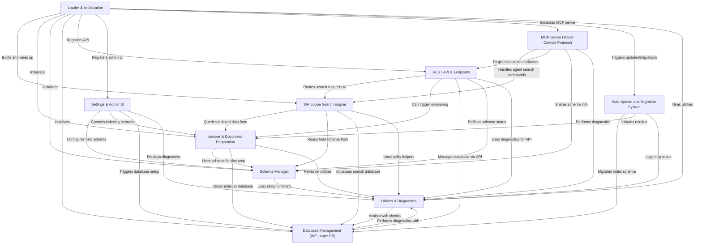

# Tutorial: wp-loupe

**WP Loupe** is a WordPress plugin that *supercharges site search*, making it much faster, typo-tolerant, and customizable. 
Instead of relying on the slow, default WordPress search, it builds a **special search index** of your content and offers an advanced, developer-friendly REST API. 
You can control exactly *which content and fields are searchable, filterable, and sortable* via an intuitive admin interface.
WP Loupe also supports integration with *external automation and AI tools* using the MCP protocol, while handling updates and migrations automatically—making it both powerful and easy to use.

**Source Repository:** [https://github.com/soderlind/wp-loupe](https://github.com/soderlind/wp-loupe)

## Chapters

1. [WP Loupe Search Engine
](01_wp_loupe_search_engine_.md)
2. [Settings & Admin UI
](02_settings___admin_ui_.md)
3. [REST API & Endpoints
](03_rest_api___endpoints_.md)
4. [MCP Server (Model Context Protocol)
](04_mcp_server__model_context_protocol__.md)
5. [Schema Manager
](05_schema_manager_.md)
6. [Indexer & Document Preparation
](06_indexer___document_preparation_.md)
7. [Database Management (WP Loupe DB)
](07_database_management__wp_loupe_db__.md)
8. [Auto-Update and Migration System
](08_auto_update_and_migration_system_.md)
9. [Utilities & Diagnostics
](09_utilities___diagnostics_.md)
10. [Loader & Initialization
](10_loader___initialization_.md)

---

Generated by [AI Codebase Knowledge Builder](https://github.com/The-Pocket/Tutorial-Codebase-Knowledge)